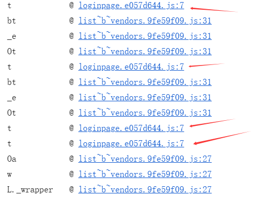
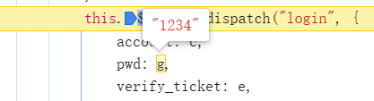
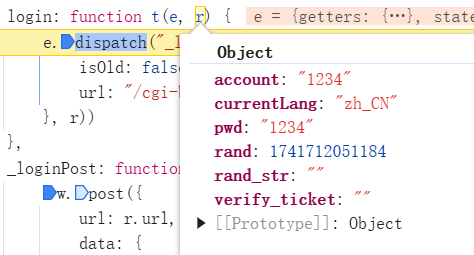

### 微信公众号加密算法分析

打开谷歌开发者工具，登录账户密码抓包。

```
username: 1234
pwd: 81dc9bdb52d04dc20036dbd8313ed055
```

查看调用栈，发现几个和`loginpage`相关，打上断点。



重新登录，开始调试



在第一个断点处并未加密，跳到下一个断点



这里`pwd`也还未加密，继续调试


仍未加密，跳到`p`函数处下断点，继续调试

```javascript
k.exports = function(n, u, i) {
    if (!u) {
        if (!i) {
            return x(n)
        } else {
            return B(n)
        }
    }
    if (!i) {
        return R(u, n)
    } else {
        return M(u, n)
    }
}
// x(n)
// '81dc9bdb52d04dc20036dbd8313ed055'
```

那么这里就找到了加密函数位置，将代码复制到本地，改为自执行函数，并将上述函数结果用`getStr`变量接收。同时不能忘记加上`substr()`。

```javascript
pwd: p(r.pwd.substr(0, 16))
```

那么最终代码如下

```javascript
var getStr
!function(I, T, h) {
    "use strict";
    var v;
    ;!(v = function(m, D, k) {
        function _(n, u) {
            var i = (n & 65535) + (u & 65535)
                , b = (n >> 16) + (u >> 16) + (i >> 16);
            return b << 16 | i & 65535
        }
        function E(n, u) {
            return n << u | n >>> 32 - u
        }
        function w(n, u, i, b, S, j) {
            return _(E(_(_(u, n), _(b, j)), S), i)
        }
        function C(n, u, i, b, S, j, F) {
            return w(u & i | ~u & b, n, u, S, j, F)
        }
        function d(n, u, i, b, S, j, F) {
            return w(u & b | i & ~b, n, u, S, j, F)
        }
        function l(n, u, i, b, S, j, F) {
            return w(u ^ i ^ b, n, u, S, j, F)
        }
        function p(n, u, i, b, S, j, F) {
            return w(i ^ (u | ~b), n, u, S, j, F)
        }
        function f(n, u) {
            n[u >> 5] |= 128 << u % 32;
            n[(u + 64 >>> 9 << 4) + 14] = u;
            var i, b, S, j, F, s = 1732584193, o = -271733879, a = -1732584194, t = 271733878;
            for (i = 0; i < n.length; i += 16) {
                b = s;
                S = o;
                j = a;
                F = t;
                s = C(s, o, a, t, n[i], 7, -680876936);
                t = C(t, s, o, a, n[i + 1], 12, -389564586);
                a = C(a, t, s, o, n[i + 2], 17, 606105819);
                o = C(o, a, t, s, n[i + 3], 22, -1044525330);
                s = C(s, o, a, t, n[i + 4], 7, -176418897);
                t = C(t, s, o, a, n[i + 5], 12, 1200080426);
                a = C(a, t, s, o, n[i + 6], 17, -1473231341);
                o = C(o, a, t, s, n[i + 7], 22, -45705983);
                s = C(s, o, a, t, n[i + 8], 7, 1770035416);
                t = C(t, s, o, a, n[i + 9], 12, -1958414417);
                a = C(a, t, s, o, n[i + 10], 17, -42063);
                o = C(o, a, t, s, n[i + 11], 22, -1990404162);
                s = C(s, o, a, t, n[i + 12], 7, 1804603682);
                t = C(t, s, o, a, n[i + 13], 12, -40341101);
                a = C(a, t, s, o, n[i + 14], 17, -1502002290);
                o = C(o, a, t, s, n[i + 15], 22, 1236535329);
                s = d(s, o, a, t, n[i + 1], 5, -165796510);
                t = d(t, s, o, a, n[i + 6], 9, -1069501632);
                a = d(a, t, s, o, n[i + 11], 14, 643717713);
                o = d(o, a, t, s, n[i], 20, -373897302);
                s = d(s, o, a, t, n[i + 5], 5, -701558691);
                t = d(t, s, o, a, n[i + 10], 9, 38016083);
                a = d(a, t, s, o, n[i + 15], 14, -660478335);
                o = d(o, a, t, s, n[i + 4], 20, -405537848);
                s = d(s, o, a, t, n[i + 9], 5, 568446438);
                t = d(t, s, o, a, n[i + 14], 9, -1019803690);
                a = d(a, t, s, o, n[i + 3], 14, -187363961);
                o = d(o, a, t, s, n[i + 8], 20, 1163531501);
                s = d(s, o, a, t, n[i + 13], 5, -1444681467);
                t = d(t, s, o, a, n[i + 2], 9, -51403784);
                a = d(a, t, s, o, n[i + 7], 14, 1735328473);
                o = d(o, a, t, s, n[i + 12], 20, -1926607734);
                s = l(s, o, a, t, n[i + 5], 4, -378558);
                t = l(t, s, o, a, n[i + 8], 11, -2022574463);
                a = l(a, t, s, o, n[i + 11], 16, 1839030562);
                o = l(o, a, t, s, n[i + 14], 23, -35309556);
                s = l(s, o, a, t, n[i + 1], 4, -1530992060);
                t = l(t, s, o, a, n[i + 4], 11, 1272893353);
                a = l(a, t, s, o, n[i + 7], 16, -155497632);
                o = l(o, a, t, s, n[i + 10], 23, -1094730640);
                s = l(s, o, a, t, n[i + 13], 4, 681279174);
                t = l(t, s, o, a, n[i], 11, -358537222);
                a = l(a, t, s, o, n[i + 3], 16, -722521979);
                o = l(o, a, t, s, n[i + 6], 23, 76029189);
                s = l(s, o, a, t, n[i + 9], 4, -640364487);
                t = l(t, s, o, a, n[i + 12], 11, -421815835);
                a = l(a, t, s, o, n[i + 15], 16, 530742520);
                o = l(o, a, t, s, n[i + 2], 23, -995338651);
                s = p(s, o, a, t, n[i], 6, -198630844);
                t = p(t, s, o, a, n[i + 7], 10, 1126891415);
                a = p(a, t, s, o, n[i + 14], 15, -1416354905);
                o = p(o, a, t, s, n[i + 5], 21, -57434055);
                s = p(s, o, a, t, n[i + 12], 6, 1700485571);
                t = p(t, s, o, a, n[i + 3], 10, -1894986606);
                a = p(a, t, s, o, n[i + 10], 15, -1051523);
                o = p(o, a, t, s, n[i + 1], 21, -2054922799);
                s = p(s, o, a, t, n[i + 8], 6, 1873313359);
                t = p(t, s, o, a, n[i + 15], 10, -30611744);
                a = p(a, t, s, o, n[i + 6], 15, -1560198380);
                o = p(o, a, t, s, n[i + 13], 21, 1309151649);
                s = p(s, o, a, t, n[i + 4], 6, -145523070);
                t = p(t, s, o, a, n[i + 11], 10, -1120210379);
                a = p(a, t, s, o, n[i + 2], 15, 718787259);
                o = p(o, a, t, s, n[i + 9], 21, -343485551);
                s = _(s, b);
                o = _(o, S);
                a = _(a, j);
                t = _(t, F)
            }
            return [s, o, a, t]
        }
        function L(n) {
            var u, i = "";
            for (u = 0; u < n.length * 32; u += 8) {
                i += String.fromCharCode(n[u >> 5] >>> u % 32 & 255)
            }
            return i
        }
        function y(n) {
            var u, i = [];
            i[(n.length >> 2) - 1] = void 0;
            for (u = 0; u < i.length; u += 1) {
                i[u] = 0
            }
            for (u = 0; u < n.length * 8; u += 8) {
                i[u >> 5] |= (n.charCodeAt(u / 8) & 255) << u % 32
            }
            return i
        }
        function $(n) {
            return L(f(y(n), n.length * 8))
        }
        function q(n, u) {
            var i, b = y(n), S = [], j = [], F;
            S[15] = j[15] = void 0;
            if (b.length > 16) {
                b = f(b, n.length * 8)
            }
            for (i = 0; i < 16; i += 1) {
                S[i] = b[i] ^ 909522486;
                j[i] = b[i] ^ 1549556828
            }
            F = f(S.concat(y(u)), 512 + u.length * 8);
            return L(f(j.concat(F), 512 + 128))
        }
        function z(n) {
            var u = "0123456789abcdef", i = "", b, S;
            for (S = 0; S < n.length; S += 1) {
                b = n.charCodeAt(S);
                i += u.charAt(b >>> 4 & 15) + u.charAt(b & 15)
            }
            return i
        }
        function Q(n) {
            return unescape(encodeURIComponent(n))
        }
        function B(n) {
            return $(Q(n))
        }
        function x(n) {
            return z(B(n))
        }
        function M(n, u) {
            return q(Q(n), Q(u))
        }
        function R(n, u) {
            return z(M(n, u))
        }
        getStr = function(n, u, i) {
            if (!u) {
                if (!i) {
                    return x(n)
                } else {
                    return B(n)
                }
            }
            if (!i) {
                return R(u, n)
            } else {
                return M(u, n)
            }
        }
    }
        .call(T, h, T, I),
    v !== void 0 && (I.exports = v))
}()

var password = "1234"
console.log(getStr(password.substr(0, 16)))
// 81dc9bdb52d04dc20036dbd8313ed055
```
